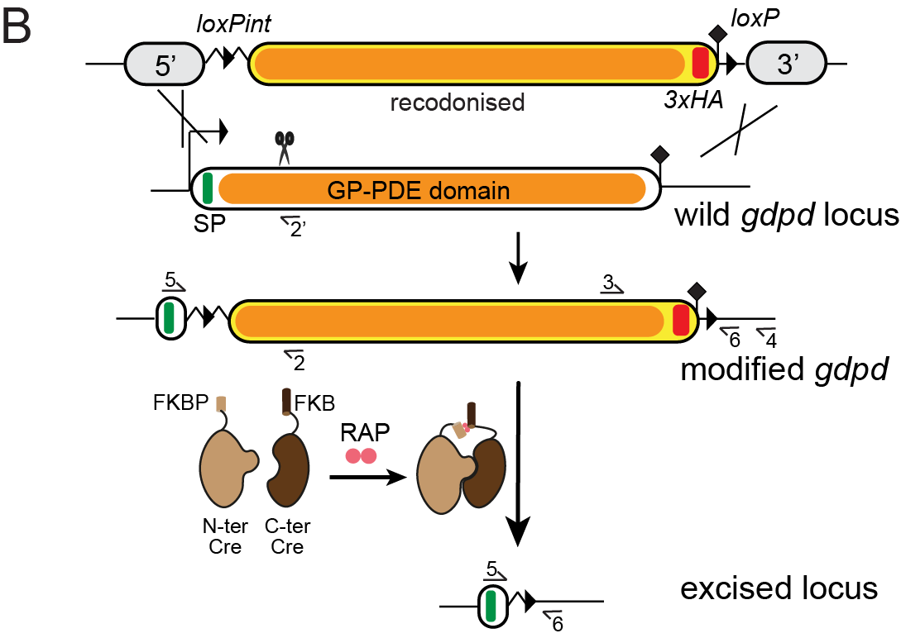
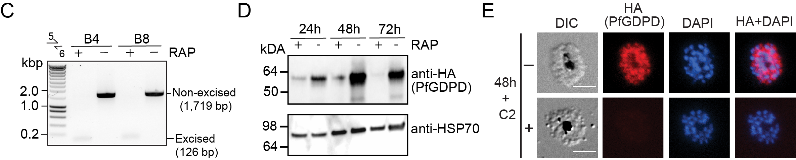
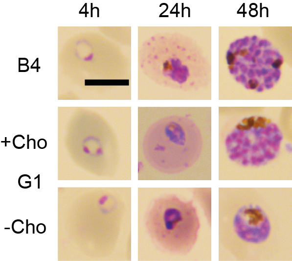
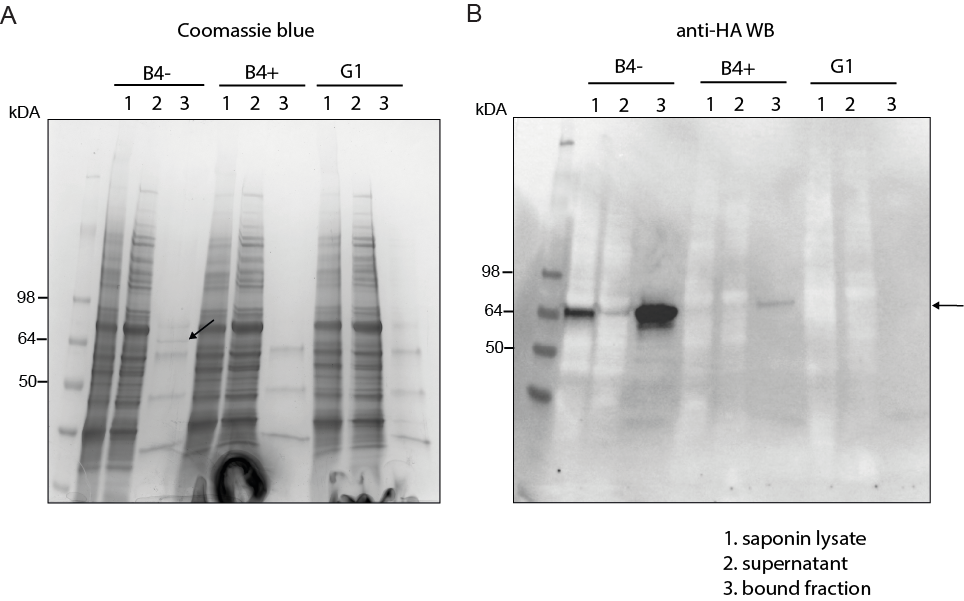
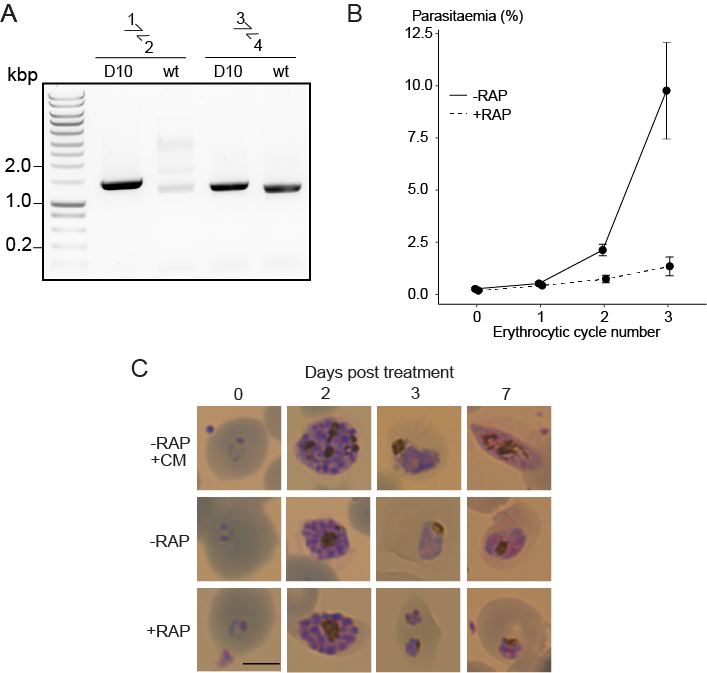

```{r setup, include=FALSE}
knitr::opts_chunk$set(echo = TRUE)

#loading all necessary R packages

library("dplyr")
library("tidyr")
library("tibble")
library("ggplot2")
library("plotly")
library("ggpubr")
library("cowplot")
library("Rmisc")
library("rstatix")
library("stringr")
library("viridis")
library("RColorBrewer")
library("magick")
library("forcats")
library("colorspace")
library("png")
library("patchwork")
library("shiny")
library("shinyWidgets")
library("rmarkdown")
```

# Summary

The malaria parasite *Plasmodium falciparum* synthesizes significant amounts of phospholipids to meet the demands of replication within red blood cells.
De novo phosphatidylcholine (PC) biosynthesis via the Kennedy pathway is essential, requiring choline that is primarily sourced from host serum lysophosphatidylcholine (lysoPC).
LysoPC also acts as an environmental sensor to regulate parasite sexual differentiation.
Despite these critical roles for host lysoPC, the enzyme(s) involved in its breakdown to free choline for PC synthesis are unknown.
Here we show that a parasite glycerophosphodiesterase (PfGDPD) is indispensable for blood stage parasite proliferation.
Exogenous choline rescues growth of PfGDPD-null parasites, directly linking PfGDPD function to choline incorporation.
Loss of PfGDPD reduces choline uptake from lysoPC, resulting in depletion of several PC species in the parasite, whilst purified PfGDPD releases choline from glycerophosphocholine *invitro*.
Our results identify PfGDPD as a choline-releasing glycerophosphodiesterase that mediates a critical step in PC biosynthesis and parasite survival.

# Introduction

## Importance of phospholipid synthesis

Malaria parasites replicate within red blood cells (RBC).
During its massive intraerythrocytic growth, the parasite produces *de novo* large amounts of membrane to support expansion of its parasite plasma membrane (PPM), the parasitophorous vacuole membrane (PVM) and other membranous structures of the growing parasite, as well as for formation of daughter merozoites.
This extensive membrane neogenesis, which culminates in a six-fold increase in the phospholipid content of the infected RBC [@Wein2018], requires an intense phase of phospholipid synthesis during the metabolically active trophozoite and schizont stages of the parasite life cycle.

## Phosphatidylcholine biosynthesis

Phosphatidylcholine (PC) is the most abundant membrane lipid in the malaria parasite, comprising 30-40% of total phospholipid [@Botté2013; @Gulati2015], and the parasite has evolved to produce this vital phospholipid via multiple enzymatic pathways from a variety of metabolic precursors from the host milieu [@Wein2018; @Kilian2018] (<a href="#fig1" >Figure 1</a>). Under normal conditions, \~89% of PC is synthesized from free choline and fatty acids via the CDP-choline-dependent Kennedy pathway that is common among eukaryotes [@Brancucci2017; @Wein2018]. Choline is phosphorylated to phosphocholine (P-Cho) by choline kinase (CK) [@Ancelin1986], then converted to CDP-choline by a CTP:phosphocholine cytidyltransferase (CCT) [@Ancelin1989] and finally condensed with diacylglycerol (DAG) by a choline/ethanolamine-phosphotransferase (CEPT) [@Vial1984] to produce PC. PC is also generated via an alternate serine-decarboxylase-phosphoethanolamine-methyltransferase (SDPM) pathway also found in plants and nematodes, that uses host serine and ethanolamine (Eth) as precursors [@Pessi2004]. In this case, precursor P-Cho for the CDP-choline pathway is produced by triple methylation of phosphoethanolamine (P-Eth) by a phosphoethanolamine methyltransferase (PMT) [@Witola2008]. Phosphoethanolamine is in turn generated from ethanolamine sourced either from the serum or converted from serine by an unidentified parasite serine decarboxylase. Unlike yeast and mammals, the malaria parasite is unable to convert PE directly to PC through phospholipid methyl transferase activity [@Witola2008], so the Kennedy and SDPM pathways intersect only at the point of PMT activity (<a href="#fig1" >Figure 1</a>). PC can also be potentially produced by direct acylation of lysoPC via the Lands' cycle by an unknown lysophosphatidylcholine acyltransferase (LPCAT). However, this pathway is considered to not contribute significantly to PC synthesis under normal conditions [@Wein2018].

<a id="fig1"> </a>

```{r fig1, echo=FALSE, fig.cap= "<B>Figure 1. Phosphatidylcholine (PC) synthesis in malaria parasites.</B> The CDP-choline dependent Kennedy pathway, the SDPM pathway and Lands’ cycle produce PC from the metabolic precursors lysoPC, choline (Cho), ethanolamine (Eth), serine (Ser, including that obtained from digestion of haemoglobin, Hb), and fatty acids, all salvaged from the host milieu. PC is primarily produced through the Kennedy pathway using Cho sourced mainly from serum lysoPC. Breakdown of lysoPC into choline is thought to occur in the parasitophorous vacuole (PV) via a two-step hydrolysis process involving an unidentified lysophospholipase (LPL) and a glycerophosphodiesterase (GDPD; PF3D7_1406300) (this work). Other abbreviations: CCT, CTP:phosphocholine cytidyltransferase; CEPT, choline/ethanolamine-phosphotransferase; CK, choline kinase; DAG, diacylglycerol; EK, ethanolamine kinase; GPC, glycerophosphocholine; LPCAT, lysophosphatidylcholine acyltransferase; PMT, phosphoethanolamine methyltransferase; SD, serine decarboxylase. “?” indicates parasite enzymes not yet identified."}

```

## PC biosynthesis is a drug target

The crucial nature of PC biosynthesis for parasite survival has generated interest in the process as a potential target for antimalarial drug development [@Ancelin1986a; @Ancelin1985].
Choline analogs have potent antimalarial activity [@Ancelin2003], whilst inhibiting or disrupting enzymes in the PC synthesis pathways severely reduces or blocks intraerythrocytic growth.
As examples of this, compounds that inhibit *P. falciparum* CK (PfCK) [@Serrán-Aguilera2016] or PfCCT [@Contet2015] in the CDP-choline pathway kill the parasite, and disruption of the PfPMT gene to block PC synthesis via the SDPM pathway results in morphological and growth defects but is not lethal [@Witola2008].
These findings suggest that the CDP-choline pathway provides the major route to PC synthesis whilst the SDPM pathway forms an important alternative route.
An improved understanding of PC biosynthesis in *Plasmodium* may identify critical enzymes in the process that are potential drug targets.

## Where does the parasite get its choline?

The choline required for PC synthesis is primarily scavenged from host serum.
Whilst free choline can cross the parasite plasma membrane efficiently through an unidentified carrier, choline transfer from serum into the infected RBC across the erythrocyte membrane is rate-limiting [@Biagini2004b; @Ancelin1985].
Perhaps to overcome this limitation, the parasite has evolved to scavenge most of the required choline from exogenous lysoPC [@Wein2018; @Brancucci2017].
Intriguingly, lysoPC also acts as an environmental sensor that controls sexual differentiation in *P. falciparum*.
Active lysoPC metabolism into PC via the CDP-choline pathway prevents sexual commitment while in contrast limited availability of lysoPC reduces formation of asexual progeny and triggers differentiation into the transmissible gametocyte stages [@Brancucci2017].
Metabolic labelling experiments showed that \~68% of free choline in the parasite comes from exogenous lysoPC, indicating that the majority of the lysoPC is broken down to choline before entering PC synthesis [@Brancucci2017].
However, it is unclear how and where lysoPC is converted to choline in the parasite and the enzymes involved in this process are unknown.

# Question

## Is PfGDPD involved in lysoPC breakdown to choline?

<a id="fig1q"> </a>

```{r fig1q, echo=FALSE}

```

LysoPC breakdown to free choline requires a two-step hydrolysis reaction: deacylation of lysoPC by a putative lysophospholipase to give glycerophosphocholine (GPC) that is then hydrolysed by a glycerophosphodiester phosphodiesterase (GDPD) to generate choline and glycerol-3-phosphate (G3P) (<a href="#fig1q" >Figure 1</a>).
GPC catabolism by GDPD has been shown to maintain a choline supply for CDP-choline-dependent PC biosynthesis in model eukaryotes [@Morita2016; @Fernández-Murray2005; @Stewart2012].
Only one putative glycerophosphodiesterase gene (PfGDPD; PF3D7_1406300) has been identified in the malarial genome [@Denloye2012].
The 475-residue predicted protein product has an N-terminal secretory signal peptide and a glycerophosphodiester phosphodiesterase domain (amino acid residues 24-466; InterPro entry IPR030395), which likely adopts a triosephosphate isomerase (TIM) barrel alpha/beta fold (<https://alphafold.ebi.ac.uk/entry/Q8IM31>) [@Rao2006; @Jumper2021; @Varadi2022].
The protein shares homology with prokaryotic GDPDs and contains a characteristic small GDPD-specific insertion (residues 75-275) within the TIM barrel structure.
Recombinant PfGDPD has been shown to have hydrolytic activity towards GPC and localization studies have suggested that the protein is present in the parasite digestive vacuole (in which breakdown of host haemoglobin takes place), as well as the cytoplasm and parasitophorous vacuole (PV) [@Denloye2012].
Repeated failed attempts to disrupt the PfGDPD gene [@Denloye2012] and a genome-wide mutagenesis screen [@Zhang2018a] suggests its essentiality for asexual stage growth.
However, its role in parasite phospholipid metabolism remains unknown.

Here, we used a conditional gene disruption approach combined with chemical complementation and metabolomic analysis to examine the essentiality and function of PfGDPD in asexual blood stages of *P. falciparum*.
Our results show that PfGDPD catalyzes a catabolic reaction that is key for lysoPC incorporation and PC synthesis in the parasite.

# Results

## Catalytically active PfGDPD is essential for *P. falciparum* blood stage growth {#result1}

### Where does PfGDPD localise to?

To confirm the previously shown subcellular localization of PfGDPD [@Denloye2012], we tagged the endogenous protein at its C-terminus by fusing the gene to a sequence encoding green fluorescent protein (GFP), using the selection-linked integration (SLI) system [@Birnbaum2017] (<a href="#figS1" >Supplementary Figure S1</a>).
We verified correct integration of the targeting plasmid into the PfGDPD locus by PCR (<a href="#figS1" >Supplementary Figure S1</a>).
Live-cell microscopy of the resulting transgenic parasites revealed a cytoplasmic and PV localization (<a href="#fig2A" >Figure 2A</a>) , supporting the results of a previous study [@Denloye2012].

###  {.tabset .tabset-fade .tabset-pills}

#### Figure

<a id="fig2A"> </a>

```{r fig2A, echo=FALSE, out.width= "75%", fig.cap= "<B>Figure 2. Subcellular localization and conditional ablation of PfGDPD.</B> A) Endogenous PfGDPD tagged with GFP shows dual localization in the cytosol and PV in mature schizonts (top) and free merozoites (bottom). Scale bars, 5 $\\mu$m."}
knitr::include_graphics("./Figures/2A.png")
```

#### Supplementary Figure

<a id="figS1"> </a>

```{r figS1, echo=FALSE, out.width= "100%", fig.cap= "<B>Supplementary Figure 1. Endogenous tagging of PfGDPD.</B> A) Schematic of SLI-based endogenous tagging of PfGDPD. GFP, green fluorescent protein; T2A, skip peptide; Neo-R, neomycin-resistance gene; hDHFR, human dihydrofolate reductase; asterisks, stop codons; arrows, promoters. B) Diagnostic PCR showing correct integration of the GFP-tagging construct in the GDPD locus."}

```

#### Methods

##### Plasmid construction

<font size="2">

Targeted gene disruption (TGD) of PfGDPD was attempted using a TGD construct pSLI-PF3D7_1406300-TGD. The N-terminal 360 bp of the gdpd gene was amplified by PCR using primers PF3D7_1406300-TAG-fw/ PF3D7_1406300-TAG-rev and cloned into pSLI-TGD [@Birnbaum2017] using NotI/MluI.
The GDPD:GFP line was made by endogenously tagging GDPD with GFP using the selection-linked integration (SLI) method [@Birnbaum2017].
A GFP-tagging construct pSLI-PF3D7_1406300-GFP-GlmS-WT was generated by amplifying the C-terminal 858 bp of the endogenous gdpd gene (PF3D7_1406300) by PCR using primers PF3D7_1406300-TAG-fw/ PF3D7_1406300-TAG-rev and cloning into pSLI-GFP-GlmS-WT using NotI/MluI.

</font>

##### Parasite culture maintenance, synchronisation and transfection

<font size="2">

*P. falciparum* 3D7 line was maintained at 37° C in an atmosphere of 1% O~2~, 5% CO~2~, and 94% N~2~ and cultured using RPMI complete medium containing 0.5% Albumax according to standard procedures [@Trager1976].
For generation of stable integrant cell line GDPD:GFP, mature schizonts of 3D7 parasites were electroporated with 50 $\mu$g of plasmid DNA using a Lonza Nucleofector II device [@Moon2013].
Parasites were first selected in medium supplemented with 3 nM WR99210 (Jacobus Pharmaceuticals).
Parasites containing the episomal plasmids selected with WR99210 were subsequently grown with 400 μg/ml Neomycin/G418 (Sigma) to select for integrants carrying the desired genomic modification as described previously [@Birnbaum2017].
Successful integration was confirmed by diagnostic PCR using FIREpol DNA polymerase (Solis BioDyne).

</font>

##### Live cell microscopy

<font size="2">

For live cell microscopy of GDPD:GFP parasites, parasites were incubated with 1 μg/ml DAPI in culture medium for 15 minutes at 37° C to stain nuclei before microscopic analysis.
Parasite line was imaged on a Leica D6B fluorescence microscope, equipped with a Leica DFC9000 GT camera and a Leica Plan Apochromat 100x/1.4 oil objective.
Image processing was performed using ImageJ [@Schneider2012].

</font>

#### Sequences

<a href="./Rawdata/GDPDGFP_oligos.xlsx" download>Click to Download</a>

###  {.unnumbered}

### Conditional ablation of PfGDPD expression

Our attempts to knockout the *pfgdpd* gene using SLI-based targeted gene disruption failed, suggesting that PfGDPD fulfils an essential function for *P. falciparum* blood stage growth as previously suggested [@Zhang2018a; @Denloye2012].
To address the essentiality and function of PfGDPD, we used a conditional gene disruption strategy to delete sequence encoding the catalytic glycerophosphodiester phosphodiesterase domain.
For this, we first flanked ("floxed") the region with loxP sites using Cas9-enhanced homologous recombination in a *P. falciparum* line stably expressing DiCre, a rapamycin (RAP) inducible form of Cre recombinase [@Collins2013] (<a href="#fig2B" >Figure 2B</a> and (<a href="#figS2" >Supplementary Figure S2</a>)).
A triple-hemagglutinin (3HA) epitope was simultaneously fused to the C-terminal end of the gene product, allowing confirmation of PfGDPD expression in the modified parasite line (called GDPD:loxPint:HA).

##  {.tabset .tabset-fade .tabset-pills}

### Figure

<a id="fig2B"> </a>

```{r fig2B, echo=FALSE, out.width= "100%", fig.cap= "<B>Figure 2. Subcellular localization and conditional ablation of PfGDPD.</B> B) Strategy used for conditional disruption of PfGDPD in parasite line GDPD:HA:loxPint. The predicted catalytic domain (orange) was floxed by introducing an upstream loxPint and a loxP site following the translational stop site. Sites of targeted Cas9-mediated double-stranded DNA break (scissors), left and right homology arms for homology-directed repair (5’ and 3’), introduced loxP sites (arrow heads), secretory signal peptide (green), recodonized sequences (yellow), HA3 epitope (red) and diagnostic PCR primers (half arrows 1-4) are indicated. RAP-induced DiCre-mediated excision results in removal of the catalytic domain."}

```

### Supplementary Figure

<a id="figS2"> </a>

```{r figS2, echo=FALSE, out.width= "100%", fig.cap= "<B>Supplementary Figure 2. Diagnostic PCR showing correct integration of the pREP-GDPD modification plasmid in the GDPD locus in GDPD:loxPint:HA line. Primers used are denoted in Figure 2B.</B>"}
knitr::include_graphics("./Figures/S2.png")
```

### Methods

#### Plasmid construction

<font size="2">

The conditional knockout GDPD:loxPint:HA line was produced by modifying the endogenous gdpd locus in the DiCre-expressing *P. falciparum* B11 line using Cas9-mediated genome editing [@Ghorbal2014].
A two-plasmid system was used where a targeting plasmid delivers Cas9 and guide RNA to target the GDPD locus while a repair plasmid delivers the repair template for homology-directed repair of the Cas9-nicked locus.
Two RNA targeting sequences (CATCAATCGTTGGTCATAGA and ACGGAGTAGAATTGGACGTA) were inserted into the pDC2 Cas9/gRNA/hDHFR (human dihydrofolate reductase)/yFCU (yeast cytosine deaminase/uridyl phosphoribosyl transferase)-containing plasmid as described previously [@Knuepfer2017] to generate two different targeting plasmids (pCas9_1406300_gRNA01 and pCas9_1406300_gRNA02 respectively).

For the repair plasmid, a 1,666 bp long synthetic DNA fragment containing a recodonised segment of almost the complete GDPD gene (69-1,425 bp; 24-475 aa) flanked upstream by a loxPint module [@Jones2016] and downstream by a triple hemagglutinin (HA) tag, a stop codon and a loxP site, was synthesized commercially (GeneArt , Thermo Fisher Scientific).
A 711 bp long 5' homology arm was amplified from parasite genomic DNA (using primers gdpd_5hom.F/gdpd_5hom.R) and inserted into the synthesized plasmid using NotI/AvrII restriction/ligation.
Similarly, a 665 bp long 3' homology arm was amplified (using primers gdpd_3hom.F/gdpd_3hom.R) and inserted using NheI/XhoI restriction/ligation reaction to produce the final repair plasmid, pREP-GDPD.
The repair plasmid was linearised with AgeI overnight prior to transfection.

CloneAmp HiFi PCR Premix (TakaraBio) and Phusion High-Fidelity DNA polymerase (New England BioLabs) were used for PCR reactions for all plasmid constructions.
All plasmid sequences were confirmed by Sanger sequencing.

</font>

#### Parasite culture maintenance, synchronisation and transfection

<font size="2">

The DiCre-expressing *P. falciparum* B11 line [@Perrin2018] was maintained at 37° C in human RBCs in RPMI 1640 containing Albumax II (Thermo Fisher Scientific) supplemented with 2 mM L-glutamine.
Synchronisation of parasite cultures were done as described previously [@Harris2005a] by isolating mature schizonts by centrifugation over 70% (v/v) isotonic Percoll (GE Healthcare, Life Sciences) cushions, letting them rupture and invade fresh erythrocytes for 2 hours at 100 rpm, followed by removal of residual schizonts by another Percoll separation and sorbitol treatment to finally obtain a highly synchronised preparation of newly invaded ring-stage parasites.

To obtain the GDPD:HA:loxPint line, transfections were performed by introducing DNA into \~10^8^ Percoll-enriched schizonts by electroporation using an Amaxa 4D Nucleofector X (Lonza), using program FP158 as previously described [@Moon2013].
For Cas9-based genetic modifications, 20 $\mu$g of targeting plasmid and 60 ug of linearised repair template were electroporated.
Drug selection with 2.5 nM WR99210 was applied 24 h post-transfection for 4 days with successfully transfected parasites arising at 14-16 days.
Clonal transgenic lines were obtained by serial limiting dilution in flat-bottomed 96-well plates [@Thomas2016a] followed by propagating wells that contain single plaques.
Successful integration was confirmed by running diagnostic PCR either directly on culture using BloodDirect Phusion PCR premix or from extracted genomic DNA (DNAeasy Blood & Tissue kit, Qiagen) with CloneAmp HiFi PCR Premix (TakaraBio).

</font>

### Sequences

<a href="./Rawdata/GDPDloxPintHA_oligos.xlsx" download>Click to Download</a>

##  {.unnumbered}

Treatment of synchronous, ring-stage GDPD:loxPint:HA parasites with RAP resulted in efficient excision of floxed sequence and ablation of protein expression as detected by PCR, western blot and IFA (<a href="#fig2CDE" >Figure 2C,D & E</a>).
Low levels of PfGDPD-HA expression were detectable by western blot in trophozoite and schizont stages that developed throughout the erythrocytic cycle of RAP-treatment (cycle 0) (<a href="#fig2CDE" >Figure 2D</a>; 24 h and 48 h), but expression was undetectable by the beginning of the following cycle (cycle 1; 72 h).

##  {.tabset .tabset-fade .tabset-pills}

### Figure

<a id="fig2CDE"> </a>

```{r fig2CDE, echo=FALSE, out.width= "100%", fig.cap= "<B>Figure 2. Subcellular localization and conditional ablation of PfGDPD.</B> C) Diagnostic PCR 12 h following mock- or RAP-treatment of ring-stage GDPD:HA:loxPint parasites (representative of 3 independent experiments) confirms efficient gene excision. Expected amplicon sizes are indicated. D) Western blots (representative of 2 independent experiments) showing successful RAP-induced ablation of PfGDPD expression in cycle 0 GDPD:HA:loxPint parasites sampled at 24 h and 48 h post invasion and cycle 1 trophozoites  (72 h) . HSP70 was probed as loading control. E) IFA of RAP-treated (+) and mock-treated (-) mature GDPD:HA:loxPint cycle 0 schizonts following mock- (-) or RAP-treatment (+) at ring-stage, showing that expression of PfGDPD-HA is lost following RAP treatment. Scale bar, 5 $\\mu$m. "}

```

### Methods

#### Excision PCR

<font size="2">

To obtain GDPD-null parasites, DiCre-mediated excision of target locus was induced by rapamycin treatment (100 nM RAP for 3 hours or 10 nM overnight) of synchronous early ring-stage parasites (2-3 h post-invasion) as previously described [@Collins2013].
DMSO treated parasites were used as wildtype controls.
Successful excision of floxed segment was confirmed by diagnostic PCR with excision primer pair 1 and 4 using CloneAmp HiFi PCR Premix (TakaraBio).

</font>

#### Western blotting

<font size="2">

Ablation of GDPD were assessed by western blotting and immunofluorescence-based detection of the triple HA tagged GDPD.
For GDPD:loxPint:HA parasites, proteins were extracted from 24h trophozoites (after saponin lysis) or 45h schizonts directly into SDS and resolved by SDS polyacrylamide gel electrophoresis (SDS-PAGE) and transferred to nitrocellulose membrane (Supported nitrocellulose membrane, Bio-Rad).
Membranes were blocked with 5% bovine serum albumin (BSA) in PBS-T (0.05% Tween 20) and subsequently probed with the rat anti-HA mAb 3F10 (Sigma, 1:1,000 dilution), followed by biotin-conjugated anti-rat antibody (Roche, 1:8,000) and then with horseradish peroxidase-conjugated streptavidin (Sigma, 1:10,000).
Immobilon Western Chemiluminescent HRP Substrate (Millipore) was used according to the manufacturer's instructions, and blots were visualized and documented using a ChemiDoc Imager (Bio-Rad) with Image Lab software (Bio-Rad).
Antibodies against HSP70 were used as loading control.

</font>

#### Immunofluorescence

<font size="2">

For immunofluorescene assays of GDPD:loxPint:HA parasites, thin films of parasite cultures containing C2-arrested mature schizonts were air-dried, fixed in 4% (w/v) formaldehyde for 30 minutes (Agar Scientific Ltd.), permeabilized for 10 minutes in 0.1% (w/v) Triton ×100 and blocked overnight in 3% (w/v) bovine serum albumin in PBS.
Slides were probed with rat anti-HA mAb 3F10 (1:500 dilution) to detect GDPD-3HA and human anti-MSP1 X509 (1:1,000) to detect merozoite surface protein 1.
Primary antibodies were detected by probing with biotin-conjugated anti-rat antibody (1:1,000) and Alexa 488-conjugated anti-human antibody (1:1,000) followed by Alexa 594-conjugated streptavidin (Invitrogen, 1:1000).
Slides were then stained with 1ug/mL DAPI, mounted in Citifluor (Citifluor Ltd., Canterbury, U.K.)., and images collected using AxioVision 3.1 software on an Axioplan 2 Imaging system (Zeiss) using a Plan-APOCHROMAT 100×/1.4 oil immersion objective.
Images were processed to their final forms in Fiji [@Schneider2012].

</font>

##  {.unnumbered}

Importantly, the RAP-treated GDPD:loxPint:HA parasites failed to proliferate, suggesting that PfGDPD is important for asexual blood stage viability of *P. falciparum* (<a href="#fig2F" >Figure 2F</a>).

##  {.tabset .tabset-fade .tabset-pills}

### Code

```{r message=FALSE, tidy=TRUE}

#Figure2F
GDPD.growthassay <- read.csv("./Rawdata/GDPDgrowthassay.csv")
summ.GDPD.growthassay <- summarySE(GDPD.growthassay, measurevar="Parasitaemia", groupvars=c("Line","Erythrocytic.cycle.number"), na.rm=TRUE)
pd<-position_dodge(0.1)
colorPalette<-c("black","black","grey","grey")
linePalette<-c(1,3,1,3)
pgrowth<-ggplot(summ.GDPD.growthassay, aes(x=Erythrocytic.cycle.number, y=Parasitaemia, group=Line)) +
  geom_errorbar(aes(ymin=Parasitaemia-se, ymax=Parasitaemia+se), width=0.25, position=pd) +
  geom_line(position=pd,aes(linetype=Line)) +
  geom_point(position=pd,size=3,shape=21,aes(fill=Line)) +
  scale_fill_manual(values=colorPalette) +
  scale_linetype_manual(values=linePalette) +
   #scale_shape_discrete(solid=T, guide=FALSE) +
  theme(axis.title.x = element_text(size=10),axis.title.y = element_text(size=10),
        legend.title=element_blank(),
        #legend.text = element_text(size = 5),legend.text.align=0,
        legend.background=element_blank(), legend.position=c(0.1,0.75), 
        legend.key=element_blank(), legend.key.width = unit(1.25,"cm"),
        axis.text=element_text(size=10,color="black"), 
        axis.line = element_line(colour = "black"),
        panel.grid=element_blank(), panel.background=element_blank()) +
  xlab("Erythrocytic cycle number") +
  ylab("Parasitaemia (%)")
iplot1<-ggplotly(pgrowth, tooltip=c("x","y"))
for (i in 1:length(iplot1$x$data)){
    if (!is.null(iplot1$x$data[[i]]$name)){
        iplot1$x$data[[i]]$name =  gsub("\\(","",str_split(iplot1$x$data[[i]]$name,",")[[1]][1])
    }
}
```

### Figure {.active}

<a id="fig2F"> </a>

```{r fig2F, echo=FALSE , dpi=72, fig.cap= "<B>Figure 2. Subcellular localization and conditional ablation of PfGDPD.</B> F) RAP-treatment results in loss of replication in two clonal lines of GDPD:HA:loxPint parasites (error bars, ± SD). Data shown are averages from triplicate biological replicates using different blood sources."}

iplot1
```

### Methods

<font size="2"> Growth assays were performed to assess parasite growth across 3-4 erythrocytic replication cycles.
Synchronous cultures of ring-stage parasites at 0.1% parasitaemia and 2% haematocrit were maintained in triplicates in 12 well plates.
50$\mu$L from each well was sampled at 0, 2, 4 and 6 days post-RAP treatment, fixed with 50$\mu$L of 0.2% glutaraldehyde in PBS and stored at 4° C for flow cytometry quantification.
Fixed parasites were stained with SYBR Green (Thermo Fisher Scientific, 1:10,000 dilution) for 20 min at 37° C and analysed by flow cytometry on a BD FACSVerse using BD FACSuite software.
For every sample, parasitaemia was estimated by recording 10,000 events and filtering with appropriate forward and side scatter parameters and gating for SYBR Green stain-positive (infected RBCs) and negative RBCs using a 527/32 detector configuration.
All data were analysed using FlowJo software.
Average fold increase in parasitaemia was calculated by averaging fold increase in parasitaemia between cycle 1, 2 and 3.
</font>

### Raw Data

<a href="./Rawdata/GDPDgrowthassay.csv" download>Click to Download</a>

##  {.unnumbered}

## Site-directed mutagenesis of catalytic residues.

In parallel, we created a second conditional gene knockout line (called GDPD:loxPint:HA:Neo-R) by using the SLI system to flox a major segment of the PfGDPD catalytic domain in parasites possessing an episomally-expressed DiCre recombinase using rapalog (Rapa) (<a href="#figS3ABCDE" >Supplementary Figure S3A</a>).
As with the GDPD:loxPint:HA line, Rapa treatment efficiently ablated PfGDPD expression (<a href="#figS3ABCDE" >Supplementary Figure S3C, D & E</a>) and the Rapa-treated parasites displayed a severe growth defect, with proliferation being reduced by more than 85% after four erythrocytic cycles in comparison to untreated parasites.
Complementation with an episomal mCherry-tagged second copy of the gene fully restored growth of the Rapa-treated GDPD:loxPint:HA:Neo-R parasites, confirming the essentiality of PfGDPD for parasite viability (<a href="#fig2G" > Figure 2G</a> and <a href="#figS3F" >Supplementary Figure S3F</a>).

##  {.tabset .tabset-fade .tabset-pills}

### Supplementary Figure

<a id="figS3ABCDE"> </a>

```{r figS3ABCDE, echo=FALSE, fig.cap= "<B>Supplementary Figure 3. Conditional disruption of PfGDPD expression using the SLI system.</B> A) Schematic of the SLI-based DiCre-mediated conditional knockout strategy used to inactivate GDPD. loxPint, loxP site within artificial intron, 3xHA, triple hemagglutinin tag. B) Diagnostic PCR showing correct integration of the SLI modification plasmid in the GDPD locus in the GDPD:loxPint:HA:Neo-R line. C) Diagnostic PCR 36 h following mock- or Rapa- treatment of ring-stage GDPD:loxPint:HA:Neo-R parasites confirms efficient gene excision. Expected amplicon sizes are indicated. D) Western blot against 3xHA-tagged GDPD in control and Rapa treated GDPD:loxPint:HA:Neo-R parasites at the of the parasite cycle in which Rapa was added to ring stage parasites. Aldolase was used as a loading control. E) IFA against 3xHA-tagged GDPD in control (untreated) and Rapa treated GDPD:loxPint:HA:Neo-R parasites at the end of the cycle, in which Rapa was added to ring stage parasites. Scale bars 5 μm."}

```

### Methods

#### Plasmid Construction

<font size="2">

The conditional knockout line, GDPD:loxPint:HA:Neo-R, was produced by modifying the endogenous gdpd locus using a SLI modification plasmid.
A DNA fragment consisting of, in tandem, a 361 bp N-terminal targeting sequence, a loxPint module and a recodonized and 3xHA-tagged GDPD C-terminal coding sequence was synthesized commercially (GeneScript) and cloned into the pSLI-loxPint:HA:T2A:Neo plasmid [@Davies2020] using BglII/SalI.

</font>

#### Parasite culture maintenance, synchronisation and transfection

<font size="2"> For generation of stable integrant cell line, GDPD:loxPint:HA:Neo-R, mature schizonts of 3D7 parasites were electroporated with 50 μg of plasmid DNA using a Lonza Nucleofector II device [@Moon2013].
Parasites were first selected in medium supplemented with 3 nM WR99210 (Jacobus Pharmaceuticals).
Parasites containing the episomal plasmids selected with WR99210 were subsequently grown with 400 μg/ml Neomycin/G418 (Sigma) to select for integrants carrying the desired genomic modification as described previously [@Birnbaum2017].
Successful integration was confirmed by diagnostic PCR using FIREpol DNA polymerase (Solis BioDyne).
Transgenic GDPD:loxPint:HA:Neo-R parasites were then further transfected with the plasmid pSkipFlox [@Birnbaum2017] and selected with 2 μg/ml blasticidin S (Invitrogen) for constitutive expression of the DiCre recombinase under the crt promoter.
</font>

#### Excision PCR

<font size="2">

For GDPD:loxPint:HA:Neo-R parasites, 250 nM rapalog (AP21967, Clontech, stored at −20° C as a 500 mM stock in ethanol, and working stocks were kept as 1:20 dilutions in RPMI at 4° C) was used to induce excision.
Medium was changed daily and fresh rapalog was added every day.

</font>

#### Western blotting

<font size="2"> For GDPD:loxPint:HA:Neo-R parasites, protein samples were resolved by SDS polyacrylamide gel electrophoresis (SDS-PAGE) and transferred to nitrocellulose membranes (LICOR).
Membranes were blocked in 5% milk in TBS-T followed by incubation in the following primary antibodies that were diluted in TBS-T containing 5% milk: rat-anti-HA 3F10 (Sigma, 1:1,000) and rabbit-anti-aldolase (1:2,000) antibodies.
Subsequently, membranes were incubated in similarly diluted secondary antibodies: goat-anti-rat-800CW (LICOR, 1:10,000) and goat-anti-rabbit-680RD (LICOR, 1:10,000) and scanned on a LICOR Odyssey FC imager.
</font>

#### Immunofluorescence

<font size="2">

For GDPD:loxPint:HA:Neo-R parasites, IFA was performed in solution.
Parasites were fixed with 4% paraformaldehyde / 0.0075% glutaraldehyde in PBS for 10 min at RT, permeabilized in 0.1% Triton X-100 in PBS for 5 min and blocked for 10 min in 3% BSA/PBS.
Samples were probed with rat anti-HA 3F10 (Sigma, 1:1,000) in blocking buffer.
Bound primary antibodies were detected using goat-anti-rat-AlexaFluor594 secondary antibodies (Thermo Scientific) diluted 1:2000 in blocking buffer additionally containing 1 μg/ml DAPI for visualization of nuclei.
</font>

### Sequences

<a href="./Rawdata/GDPDloxPintHANeoR_oligos.xlsx" download>Click to Download</a>

##  {.unnumbered}

Like related GDPD enzymes, PfGDPD possesses two conserved predicted active site histidine residues (His29 and His78) and three metal-binding residues (Glu63, Asp65 and Glu283) that coordinate a Mg2+ cation in the active site and are likely required for activity [@Shi2008].
Consistent with this, recombinant PfGDPD has been previously shown to display Mg2+-dependent glycerophosphodiesterase activity [@Denloye2012].
To assess the importance of catalytic activity in PfGDPD function, we substituted both the H29 and H78 codons and a metal-binding glutamate (E283) codon with alanine in the complementation vector used in the GDPD:loxPint:HA:Neo-R parasites.
Mutagenesis of these key residues did not alter the subcellular localization of the transgenic PfGDPD:H29A:H78A:E283A proteins (<a href="#figS3F" >Supplementary Figure S3F</a>) but completely abolished rescue of parasite growth upon Rapa-mediated disruption of the chromosomal gene (<a href="#fig2G" >Figure 2G</a>).
These results strongly suggest that the essential function of PfGDPD depends on its catalytic activity.

##  {.tabset .tabset-fade .tabset-pills}

### Code

```{r}
GDPD.comp <- read.csv("./Rawdata/GDPDcomplementation.csv")
summ.GDPD.comp <- summarySE(GDPD.comp, measurevar="Relative.percentage", groupvars=c("Line","Erythrocytic.cycle.number"), na.rm=TRUE)
pd<-position_dodge(0.1)
colorPalette<-c("#999999", "#E69F00", "#56B4E9", "#009E73","#F0E442", "#0072B2", "#D55E00", "#CC79A7")
#linePalette<-c(3,3,1,1)
ppercentages<-ggplot(summ.GDPD.comp, aes(x=Erythrocytic.cycle.number, y=Relative.percentage, group=Line)) +
  geom_errorbar(aes(ymin=Relative.percentage-se, ymax=Relative.percentage+se), size=0.25,width=0.25, position=pd, alpha=1, linetype=1) +
  geom_line(position=pd) +
  geom_point(position=pd,size=3,shape=21,aes(fill=Line)) +
  scale_fill_manual(values=colorPalette) +
  theme(axis.title.x = element_text(size=10),axis.title.y = element_text(size=10),
        legend.title=element_blank(),
        #legend.text = element_text(size = 5),legend.text.align=0,
        legend.background=element_blank(), legend.position=c(0.2,0.25), 
        legend.key=element_blank(), legend.key.size = unit(0.25,"cm"),
        axis.text=element_text(size=10,color="black"), axis.line = element_line(colour = "black"),
        panel.grid=element_blank(), panel.background=element_blank()) +
  xlab("Erythrocytic cycle number") +
  ylab("Relative % of DMSO-treated")

iplot2<-ggplotly(ppercentages, tooltip=c("x","y")) 

iplot2<- iplot2 %>%
  layout(images=list(
      source = base64enc::dataURI(file = "./Figures/2Gi.png"),
           xref = "paper",
           yref = "paper",
           x= 1,
           y= 0.5,
           sizex = 0.5,
           sizey = 0.5
    )
  )
```

### Figure {.active}

<a id="fig2G"> </a>

```{r fig2G, echo=FALSE, fig.cap= "<B>Figure 2. Subcellular localization and conditional ablation of PfGDPD.</B> G) Genetic complementation with an episomal, constitutively expressed mCherry-tagged PfGDPD fully restores growth of RAP-treated GDPD:loxPint:HA:Neo-R parasites. In contrast, mutant PfGDPD alleles carrying Ala substitutions of the catalytic H29 and H78 residues or the metal-binding residue E283 do not complement. Inset, zoomed AlphaFold model of PfGDPD catalytic groove and coordinated Mg2~+~ ion, with relevant residues highlighted in red. The erythrocytic cycle when rapalog was added has been designated as cycle 0."}

iplot2
```

### Supplementary Figure

<a id="figS3F"> </a>

```{r figS3F, echo=FALSE, out.width= "75%", fig.cap= "<B>Supplementary Figure 3. Conditional knockout of PfGDPD expression using the SLI system.</B> F) Mutagenesis of several key functional residues does not affect localization of GDPD. Live-cell microscopy of C2-arrested GDPD:loxPint:HA:Neo-R schizonts expressing the unmutated (WT) and mutated PfGDPD coding sequence c-terminally fused to mCherry. Nuclei were stained with DAPI (blue). DIC, differential interference contrast. Scale bars 5 μm."}
knitr::include_graphics("./Figures/S3F.png")
```

### Methods

#### Plasmid construction

<font size="2"> Gene complementation vectors was constructed by amplifying the GDPD coding sequence without stop codon using primers PF3D7_1406300-COMP-fw /PF3D7_1406300-COMP-rev and cloning via XhoI/SpeI into the pNMD3:1xNLS-FRB-mCherry-DHODH plasmid [@Birnbaum2017], thus replacing the 1xNLS-FRB sequence with the GDPD coding sequence to obtain pNMD3:PF3D7_1406300-mCherry-DHODH.
Mutagenesis of the putative active site residues (H29, H78) and a putative metal-binding residue (E283) was performed by overlap extension PCR.
</font>

#### Parasite culture maintenance, synchronisation and transfection

<font size="2">

For gene complementation, GDPD:loxPint:HA:Neo-R parasites were further transfected with wildtype or mutated versions of the pNMD3:PF3D7_1406300-mCherry-DHODH plasmid, which were selected for with 0.9 μM DSM1 (BEI Resources).

</font>

#### Growth assays

<font size="2"> For GDPD:loxPint:HA:Neo-R parasites, parasitemia was analyzed at 1, 3, 5, and 7 days post Rapalog addition.
Cultures were diluted 10-fold into fresh RBCs after the 5th day to prevent overgrowth.
Parasitaemia assessment was performed as described previously [@Malleret2011].
In brief, 20 μl resuspended parasite culture was incubated with dihydroethidium (5 μg/ml, Cayman) and SYBR Green I dye (0.25 x dilution, Invitrogen) in a final volume of 100 μl medium for 20 min at RT protected from light.
Samples were analyzed (100,000 events) on a ACEA NovoCyte flow cytometer.
</font>

### Raw Data

<a href="./Rawdata/GDPDcomplementation.csv" download>Click to Download</a>

### Sequences

<a href="./Rawdata/GDPDcomplementation_oligos.xlsx" download>Click to Download</a>

##  {.unnumbered}

# PfGDPD is required for trophozoite development {#result2}

To define in more detail the phenotypic consequences of loss of PfGDPD, intracellular development of the PfGDPD-null mutants was monitored by microscopy and flow cytometry following RAP-treatment (<a href="#fig3A" >Figure 3A</a>).
Mutant parasites developed normally throughout the erythrocytic cycle of treatment (cycle 0) and were able to egress and invade fresh RBCs.
However, looking more closely at the transition between cycle 0 and cycle 1, we observed that parasitaemia in the PfGDPD-null cultures were lower than controls in cycle 1 (25% versus 34%) (<a href="#fig3B" >Figure 3B</a>).
Short-term replication assays under both shaking and static conditions confirmed lower fold increases in parasitaemia in the RAP-treated parasites in the transition from cycle 0 to cycle 1 (<a href="#fig3C" >Figure 3C</a>).
Mean numbers of merozoites in mature cycle 0 GDPD-null schizonts were slightly lower than wild type schizonts, perhaps contributing to the lower replication rate (<a href="#fig3D" >Figure 3D</a>).
By \~24 h into cycle 1 most of the PfGDPD-null trophozoites were developmentally arrested at which point we also detected a decrease in DNA content (<a href="#fig3A" >Figure 3A</a>).
Microscopic quantification of the various developmental stages at a range of selected time-points confirmed that the majority (\~88%) of PfGDPD-null mutants failed to reach schizont stage in cycle 1, instead arresting as rings or trophozoites (<a href="#fig3B" >Figure 3B</a>).
The developmental defect was also independently verified in GDPD:loxPint:HA:Neo-R parasites upon Rapa treatment (<a href="#figS3GH" >Supplementary Figure S3GH</a>).

##  {.tabset .tabset-fade .tabset-pills}

### Figure

<a id="fig3A"> </a>

```{r fig3A, echo=FALSE, fig.cap= "<B>Figure 3. PfGDPD is essential for asexual blood stage development .</B> A) Light microscopic images of Giemsa-stained cycle 0 and 1 GDPD:HA:loxPint parasites  following mock- or RAP-treatment at ring stage (representative of 2 independent experiments). PfGDPD-null parasites began to exhibit defective development at around 19 h post-invasion in cycle 1, producing abnormal trophozoites. The growth defect was confirmed and quantified using flow cytometry to measure parasite DNA content. Fluorescence intensity of the SYBR Green-stained RAP-treated population (red) was detectably lower than that of the control population (grey) from 19 h into cycle 1.  Scale bar, 5 $\\mu$m."}

```

### Supplementary Figure

<a id="figS3GH"> </a>

```{r figS3GH, echo=FALSE, fig.cap= "<B>Supplementary Figure 3. Conditional knockout of PfGDPD expression using the SLI system.</B> G) Light microscopic images of Giemsa-stained GDPD:loxPint:HA:Neo-R parasites following mock- or Rapa-treatment at ring stages. H) Life stage quantification of GDPD:loxPint:HA:Neo-R parasites at selected time points in cycle 1 (error bars, ± SD, triplicate Rapa treatments)."}
knitr::include_graphics("./Figures/S3GH.png")
```

### Methods

<font size="2"> For GDPD:loxPint:HA parasites, growth stage progression was monitored by microscopic examination at selected timepoints using Giemsa-stained thin blood films.
Samples were also fixed at these timepoints for flow cytometry analysis.
Fluorescence intensity of the SYBR Green stain-positive population was quantified to assess DNA content, the increase of which was taken as a proxy for growth stage progression.
For GDPD:loxPint:HA:Neo-R parasites, synchronous ring stage cultures were diluted to \~0.1 and \~1% parasitaemia in 2 ml dishes, which were either left untreated or treated with rapalog as described.
Quantification of developmental stages was done from Giemsa-stained blood films prepared at 40/48 hpi (1% starting parasitaemia) and 88/96 hpi (0.1% starting parasitaemia).
At least 20 fields of view were recorded using a 63x objective per sample.
Erythrocyte numbers were then determined using the automated Parasitaemia software (<http://www.gburri.org/parasitemia/>) and the number of the different parasite stages was manually counted on these images.
</font>

##  {.unnumbered}

##  {.tabset .tabset-fade .tabset-pills}

### Code

```{r,warning=FALSE,message=FALSE}
gdpdstages <- read.csv("./Rawdata/GDPDstagequant.csv")
gdpdstages<- gdpdstages %>% group_by(t.cycle1,replicate,sample) %>% mutate(pct = count*parasitaemia/sum(count))
summ.gdpdstages<-summarySE(gdpdstages,measurevar="pct",groupvars=c("t.cycle1","stage","sample"))
summ.gdpdstages <- ddply(summ.gdpdstages,.(t.cycle1,sample),transform,ybegin = cumsum(pct) + se,yend = cumsum(pct) - se)
stackplot<-ggplot(summ.gdpdstages,aes(x=t.cycle1, y=pct, fill=stage)) +
  scale_fill_brewer(palette = "Set1") +
    geom_area(aes(fill= stage), alpha=0.8, size=0.5, colour="black", position = position_stack(reverse = TRUE)) +
  geom_ribbon(aes(ymax=ybegin , ymin= yend ),alpha=0.7)  +
  ylim(0,45) +
  scale_x_continuous(breaks=c(20,24,36)) +
  theme_minimal() +
  facet_grid(. ~ sample) +
  labs(x="Hours post invasion (Cycle 1)",y="Parasitaemia (%)") +
  theme(axis.text=element_text(size=12,color="black"), 
        strip.text.x = element_text(size = 12, face = "bold"),
        legend.position="top",
        legend.direction = "horizontal",
        legend.title = element_blank())

iplot3<-ggplotly(stackplot, tooltip=c("x","y"))
```

### Figure {.active}

<a id="fig3B"> </a>

```{r fig3B, echo=FALSE, fig.cap= "<B>Figure 3. PfGDPD is essential for asexual blood stage development.</B> B) Life stage quantification of GDPD:HA:loxPint parasites at selected time points in cycle 1 (error bars, ± SD, triplicate RAP treatments) following RAP treatment of rings in cycle 0. Mock-treated parasites (DMSO) transitioned normally from trophozoite to schizont stage while RAP-treated parasites showed accumulation of abnormal ring and trophozoite forms."}

iplot3

```

### Methods

<font size="2"> Life stages were identified as rings, trophozoites or schizonts based on morphology and quantified across three independent RAP or DMSO treatments.
</font>

### Raw Data

<a href="./Rawdata/GDPDstagequant.csv" download>Click to Download</a>

##  {.unnumbered}

##  {.tabset .tabset-fade .tabset-pills}

### Code

```{r}
gdpdinvasion <- read.csv("./Rawdata/GDPDinvasionassay.csv")

gdpdinvasion.FC<-spread(gdpdinvasion,Timepoint,Parasitaemia,fill=0) %>% transmute(Line,Treatment,Condition,Replicate,FoldChange=AFTER/BFOR)

pinvasion<-ggplot(gdpdinvasion.FC,
       aes(x=factor(Treatment),y=FoldChange)) +
  geom_dotplot(aes(fill = Treatment),   # Use fill = Species here not in ggplot()
                 binaxis = "y",         # which axis to bin along
                 binwidth = 0.2,        # Minimal difference considered diffeerent
                 stackdir = "center",    # Centered
                 dotsize = 0.75
               ) +
stat_summary(fun = median, 
             fun.min = median, 
             fun.max = median,
             geom = "crossbar", 
             width = 0.5) +
  facet_grid(.~Condition,labeller=labeller(Condition=c(SHAK="SHAKING",STAT="STATIC"))) +
  theme_bw() +
  theme(axis.text=element_text(color="black"),
        panel.grid=element_blank(), 
        panel.background=element_blank(),
        legend.position="none") +
  scale_fill_manual(values = c("#BBBBBB","#CC3311")) +
  xlab("Treatment") + 
  ylab("Fold Change in Parasitaemia")

pwc <- gdpdinvasion.FC %>% group_by(Condition) %>%
  t_test(FoldChange ~Treatment, p.adjust.method = "bonferroni") %>%
  add_xy_position(x = "Treatment", fun = "mean_sd", dodge = 0.8)

pinvasion <- pinvasion + stat_pvalue_manual(
    pwc, label = "p", tip.length = 0.01,
    bracket.nudge.y = 1
    ) +
  scale_y_continuous(expand = expansion(mult = c(0.1, 0.1)))
#plotly does not work with geom_dotplot
```

### Figure {.active}

<a id="fig3C"> </a>

```{r fig3C, echo=FALSE, dpi=72, fig.cap= "<B>Figure 3. PfGDPD is essential for asexual blood stage development.</B> C) PfGDPD-null parasites exhibit an invasion defect. Fold change in parasitaemia after 4 h invasion of mock-treated (-) and RAP-treated (+) GDPD:HA:loxPint schizonts under shaking and static conditions (crossbar represents median fold change in four replicate RAP treatments with different blood sources; individual points represent a single replicate)."}

pinvasion

```

### Methods

<font size="2"> To assess invasion rates, highly synchronous mature schizonts were added to fresh erythrocytes (2% haematocrit) and let to invade for four hours at both static and mechanical shaking (100 rpm) conditions (four replicates in each condition).
Cultures were sampled before and after the 4 h invasion and fixed as before for quantification.
</font>

### Raw Data

<a href="./Rawdata/GDPDinvasionassay.csv" download>Click to Download</a>

##  {.unnumbered}

##  {.tabset .tabset-fade .tabset-pills}

### Code

```{r,warning=FALSE,message=FALSE}
GDPD.merozoites<-read.csv("./Rawdata/GDPDmerozoites.csv")

pmerozoites<- ggplot(GDPD.merozoites,
       aes(x=factor(Treatment),y=MerozoiteNo)) +
  geom_dotplot(aes(fill = Treatment),   # Use fill = Species here not in ggplot()
                 binaxis = "y",         # which axis to bin along
                 binwidth = 0.5,        # Minimal difference considered diffeerent
                 stackdir = "center"    # Centered
                 ) +
stat_summary(fun = median, fun.min = median, fun.max = median,
                 geom = "crossbar", width = 0.5) +
  theme_bw() +
  scale_fill_manual(values = c("#BBBBBB","#CC3311")) +
  theme(axis.text=element_text(color="black"),panel.grid=element_blank(), panel.background=element_blank(), legend.position = "none") +
  xlab("Treatment") +
  ylab("Merozoite Number")

pwc <- GDPD.merozoites %>%
  t_test(MerozoiteNo ~Treatment, p.adjust.method = "bonferroni") %>%
  add_xy_position(x = "Treatment", fun = "mean_sd", dodge = 0.8)

pmerozoites<- pmerozoites + stat_pvalue_manual(
    pwc, label = "p", tip.length = 0.01,
    bracket.nudge.y = 5
    ) +
  scale_y_continuous(expand = expansion(mult = c(0.1, 0.1)))

#plotly does not work with geom_dotplot
```

### Figure {.active}

<a id="fig3D"> </a>

```{r fig3D, echo=FALSE, dpi=72, fig.cap= "<B>Figure 3. PfGDPD is essential for asexual blood stage development.</B> D) Numbers of merozoites in highly mature cycle 0 schizonts (obtained by arresting egress using the reversible egress inhibitor C2) following mock (-) or RAP-treatment (+) at ring stage. Merozoite numbers were slightly but significantly lower in PfGDPD-null parasites. (crossbar represents median; n=50; Student t-test with Bonferroni adjusted p-value)"}

pmerozoites

```

### Methods

<font size="2"> Merozoite numbers were estimated from Giemsa-stained blood films of schizonts let to mature by arresting egress using C2 (1:10,000) for 3 hours.
</font>

### Raw Data

<a href="./Rawdata/GDPDmerozoites.csv" download>Click to Download</a>

##  {.unnumbered}

Transmission electron microscopy (TEM) analysis of the growth-stalled cycle 1 trophozoites did not reveal any discernible abnormalities in morphology or membrane formation.
However, we observed noticeably decreased haemozoin crystal formation in the digestive vacuole of PfGDPD-null parasites in all developmental stages (<a href="#fig3E" >Figure 3E</a> and <a href="#figS4" >Supplementary Figure 4</a>).
Haemozoin content of PfGDPD-null parasites was also significantly lower than in wildtype parasites both in 44h schizonts in cycle 0 (despite normal growth progression) and in 24h trophozoites in cycle 1 when quantified using polarization microscopy (<a href="#fig3F" >Figure 3F</a>).

##  {.tabset .tabset-fade .tabset-pills}

### Figure

<a id="fig3E"> </a>

```{r fig3E, echo=FALSE, fig.cap= "<B>Figure 3. PfGDPD is essential for asexual blood stage development .</B> E) TEM micrographs of control and RAP-treated GDPD:HA:loxPint parasites allowed to mature for ~40 h in cycle 1 in order to maximise proportions of abnormal forms. Less haemozoin formation was evident in the digestive vacuole (arrowed) of the PfGDPD-null mutants compared to mock-treated controls. Scale bar, 500 nm."}
knitr::include_graphics("./Figures/3E.png")
```

### Supplementary Figure

<a id="figS4"> </a>

```{r figS4, echo=FALSE, fig.cap= "<B>Supplementary Figure 4.</B>  TEM images of mock and RAP-treated GDPD:loxPint:HA parasites at different stages of development – (from left to right ) young trophozoites, late trophozoite (with double nuclei) and a partially segmented schizont. Scale bar, 500 nm."}
knitr::include_graphics("./Figures/S4.png")
```

### Methods

<font size="2"> GDPD:loxPint:HA synchronous ring stage parasites were treated with RAP and allowed to progress to 40h in the next cycle to obtain a population of growth arrested GDPD-null parasites.
These parasites were fixed with 2.5% glutaraldehyde/ 4% formaldehyde in 0.1 M phosphate buffer (PB) for 30 minutes at room temperature (RT).
Parasites were embedded in 3% low melting point agarose and cut into 1 mm^3^ blocks.
The blocks were then processed using a modified version of the NCMIR protocol [@deerinck2010].
Briefly, blocks were washed in 0.1M PB and post-fixed with 1% reduced osmium (1% OsO~4~/ 1.5% K~3~Fe(CN)~6~) for 1 hour at 4° C, and then washed in double distilled water (ddH~2~O).
The blocks were incubated in 1% thiocarbohydrazide (TCH) for 20 mins at RT, rinsed in ddH~2~O and further fixed with 2% osmium tetroxide for 30 mins at RT.
The blocks were then stained with 1% uranyl acetate at 4° C overnight, washed in ddH~2~O and stained with Walton's lead aspartate for 30 mins at 60° C.
The blocks were washed in ddH~2~O and dehydrated stepwise using serial dilutions of ethanol: 30% and 50% at RT for 5 mins each, then 70%, 90% and 2 x 100% for 10 mins each.
The blocks were infiltrated with 4:1 mixture of propylene oxide (PO):Durcupan resin (Sigma Aldrich) for 1 hour at RT, followed by 1:1 and 1:4 mixtures for 1 hour each at RT, then with 100% Durcupan resin for 48 hours.
Blocks were polymerised in fresh Durcupan resin at 60° C for 48 hours.
The samples were cut into 70 nm ultrathin sections using an ultramicrotome (UC7, Leica Microsystems UK) and picked up onto copper mesh grids (Agar Scientific).
Images were obtained on a 120 kV transmission electron microscope (TEM) (Tecnai G2 Spirit BioTwin, Thermo Fisher Scientific) using a charge-coupled device camera (Oneview, Gatan Inc.).
</font>

##  {.unnumbered}

##  {.tabset .tabset-fade .tabset-pills}

### Code

```{r,warning=FALSE,message=FALSE}
GDPD.polarisation <- read.csv("./Rawdata/GDPDpolarisation.csv",header = T)
GDPD.polarisation <- GDPD.polarisation %>% pivot_longer(T44B4min:T72B4plus,names_to = "Group") %>%
  mutate(Treatment= case_when(Group %in% c("T44B4min","T72B4min") ~ "-RAP",
                              Group %in% c("T44B4plus","T72B4plus") ~ "+RAP"))

ppol<- ggplot(GDPD.polarisation,
       aes(x=factor(Group),y=value)) +
  geom_dotplot(aes(fill = Treatment),   # Use fill = Species here not in ggplot()
                 dotsize=5,
                 binaxis = "y",         # which axis to bin along
                 binwidth = 0.75,        # Minimal difference considered diffeerent
                 stackdir = "center"    # Centered
                 ) +
stat_summary(fun = median, fun.min = median, fun.max = median,
                 geom = "crossbar", width = 0.25) +
  theme_bw() +
  scale_fill_manual(values = c("#BBBBBB","#CC3311")) +
  theme(axis.text=element_text(color="black"),panel.grid=element_blank(), panel.background=element_blank(), legend.position = "none") +
  xlab("Group") +
  ylab("Transmitted polarised light (AU)")

pwc <- GDPD.polarisation %>%
  t_test(value ~Group, p.adjust.method = "bonferroni") %>%
  add_xy_position(x = "Group", fun = "mean_sd", dodge = 0.8) %>%
  mutate(y.position =200)
pwc<- pwc %>% filter(group1 %in% "T44B4min" & group2 %in% "T44B4plus" | group1 %in% "T72B4min" & group2 %in% "T72B4plus")

ppol<- ppol + stat_pvalue_manual(
    pwc, label = "p", tip.length = 0.01,
    bracket.nudge.y = 4
    ) +
  scale_y_continuous(expand = expansion(mult = c(0.1, 0.1)))

#plotly does not work with geom_dotplot
```

### Figure {.active}

<a id="fig3F"> </a>

```{r fig3F, warning=FALSE, echo=FALSE, dpi=72, fig.cap= "<B>Figure 3. PfGDPD is essential for asexual blood stage development.</B> F) Haemozoin content of individual parasites measured as transmitted polarized light at 44hpi in cycle 0 and 24h in cycle 1. (crossbar represents median; n=50; Student t-test with Bonferroni adjusted p-value)"}

ppol

```

### Methods

<font size="2">

Haemozoin content was visualized and quantified in methanol-fixed thin blood films taken at specified timepoints using transmitted polarized light (488 nm) in a Zeiss Axio Observer.Z1 microscope fitted with a 63x/1.4NA Plan Apochromat objective, transmitted white light LED (Thorlabs) and imaged with a Hamamatsu OrcaSpark CMOS camera.
A polarizer was placed above the sample and an analyser module in the filter turret below the sample.
The polarizer was rotated to cross with the analyser at 90°.
Only well-focussed haemozoin signals were chosen for quantification using FIJI and around 50 parasites were measured for each group and timepoint.

</font>

### Raw Data

<a href="./Rawdata/GDPDpolarisation.csv" download>Click to Download</a>

##  {.unnumbered}

Collectively, these data showed that upon RAP-treatment at ring stage to ablate PfGDPD expression, parasites were able to develop normally to schizonts in cycle 0, perhaps due to the presence of residual enzyme, but show defective growth and reduced replication rate at the schizont stages and a definitive developmental arrest at trophozoite stages in the following cycle.

# Choline supplementation rescues the PfGDPD-null phenotype {#result3}

To test for a role for PfGDPD in supplying choline to the parasite, we examined whether provision of exogenous choline could rescue the developmental defect displayed by PfGDPD-null mutants.
This was indeed the case; in the presence of supraphysiological concentrations of choline (but not ethanolamine or serine), the RAP-treated GDPD:loxPint:HA parasites retained normal morphology and DNA content (<a href="#fig4A" >Figure 4A</a>) and were able to proliferate, albeit at a \~30% slower rate than controls (<a href="#fig4B" >Figure 4B</a> and <a href="#fig4C" >Figure 4C</a>).

##  {.tabset .tabset-fade .tabset-pills}

### Figure

<a id="fig4A"> </a>

```{r fig4A, echo=FALSE,out.width="50%", fig.cap= "<B>Figure 4. Choline supplementation rescues growth of PfGDPD-null parasites.</B> A) Morphology of PfGDPD-null trophozoites at 32 h in cycle 1 following RAP treatment of rings in cycle 0 in the presence or absence of choline. Fluorescence intensity of SYBR Green-stained populations at the same timepoint show choline-supplemented PfGDPD-null trophozoites (blue) can surpass the developmental arrest in non-supplemented parasites. Scale bar, 5 $\\mu$m."}
knitr::include_graphics("./Figures/4A.png")
```

### Methods

<font size="2"> To assess if exogenous precursors can rescue the growth defect in GDPD-null parasites, cultures were grown in the presence or absence of 1mM choline chloride (Sigma).
Fresh precursor-supplemented media was provided at around 24 hpi of each erythrocytic cycle.
Giemsa Blood smears and samples were fixed at 32h for flow cytometry analysis.
Fluorescence intensity of the SYBR Green stain-positive population was quantified to assess DNA content.
</font>

##  {.unnumbered}

##  {.tabset .tabset-fade .tabset-pills}

### Code

```{r}
GDPD.Cho.growthassay <- read.csv("./Rawdata/GDPDcholinegrowthassay.csv")
summ.GDPD.Cho.growthassay <- summarySE(GDPD.Cho.growthassay, measurevar="Parasitaemia", groupvars=c("Line","Erythrocytic.cycle.number"), na.rm=TRUE)
pd<-position_dodge(0.1)
colorPalette<-c("#BBBBBB","#BBBBBB","#CC3311","#CC3311")
linePalette<-c("dotted","solid","dotted","solid")
pgrowth<-ggplot(summ.GDPD.Cho.growthassay, aes(x=Erythrocytic.cycle.number, y=Parasitaemia, group=Line)) +
  geom_errorbar(aes(ymin=Parasitaemia-se, ymax=Parasitaemia+se), width=0.25, position=pd, alpha=1, linetype=1) +
  geom_line(position=pd,size=0.75,aes(linetype=Line)) +
  geom_point(position=pd,size=3,alpha=1,shape=21,aes(fill=Line)) +
  scale_fill_manual(values=colorPalette) +
  scale_linetype_manual(values=linePalette) +
  theme(axis.title.x = element_text(size=10),axis.title.y = element_text(size=10),
        legend.title=element_blank(),legend.text = element_text(size = 7),legend.text.align=0,
        legend.background=element_blank(), legend.position=c(0.2,0.75), 
        legend.key=element_blank(), legend.key.size = unit(2,"line"),
        axis.text=element_text(size=10,color="black"), axis.line = element_line(colour = "black"),
        panel.grid=element_blank(), panel.background=element_blank()) +
  xlab("Erythrocytic cycle number") +
  ylab("Parasitaemia (%)") +
  scale_y_log10()

iplot4<-ggplotly(pgrowth, tooltip=c("x","y"))
for (i in 1:length(iplot4$x$data)){
    if (!is.null(iplot4$x$data[[i]]$name)){
        iplot4$x$data[[i]]$name =  gsub("\\(","",str_split(iplot4$x$data[[i]]$name,",")[[1]][1])
    }
}

```

### Figure {.active}

<a id="fig4B"> </a>

```{r fig4B, echo=FALSE, dpi=72, fig.cap= "<B>Figure 4. Choline supplementation rescues growth of PfGDPD-null parasites.</B> B) Replication of mock- (grey) and RAP-treated (red) GDPD:HA:loxPint parasites in the presence (solid line) or absence (dashed line) of choline (error bars, ± SD, triplicate experiments with different blood sources)."}

iplot4

```

### Methods

<font size="2">

RAP- and DMSO-treated GDPD:loxPint:HA cultures were grown in the presence or absence of 1mM choline chloride (Sigma).
Fresh precursor-supplemented media was provided at around 24 hpi of each erythrocytic cycle.
Growth assay was performed as detailed in

</font>

### Raw Data

<a href="./Rawdata/GDPDcholinegrowthassay.csv" download>Click to Download</a>

##  {.unnumbered}

##  {.tabset .tabset-fade .tabset-pills}

### Code

```{r}
GDPD.Cho.rates <- read.csv("./Rawdata/GDPDrates.csv")

prates<- ggplot(GDPD.Cho.rates,
       aes(x=Line,y=Average.Fold.Increase)) +
  geom_dotplot(aes(fill = Line),   # Use fill = Species here not in ggplot()
                 binaxis = "y",         # which axis to bin along
                 binwidth = 0.5,        # Minimal difference considered diffeerent
                 stackdir = "center",    # Centered
                 dotsize=0.4
               ) +
stat_summary(fun = median, fun.min = median, fun.max = median,
                 geom = "crossbar", width = 0.5) +
  theme_bw() +
  scale_fill_manual(values = c("#BBBBBB","#CC3311","#BBBBBB","#CC3311","#BBBBBB","#CC3311","#BBBBBB","#CC3311")) +
  theme(axis.text=element_text(color="black"),
        axis.text.x = element_text(angle = 45, hjust = 1),
        panel.grid=element_blank(),
        panel.background=element_blank(),
        legend.position = "none") +
  xlab("Treatment") +
  ylab("Average Fold Increase")

pwc <- GDPD.Cho.rates %>%
  t_test(Average.Fold.Increase ~Line, p.adjust.method = "bonferroni") %>% 
  filter(group1==" +Cho -RAP" & group2==" +Cho +RAP" |
           group1==" +Eth -RAP" & group2==" +Eth +RAP" |
           group1==" +Ser -RAP" & group2==" +Ser +RAP" |
           group1==" -Cho -RAP" & group2==" -Cho +RAP") %>%
  add_xy_position(x = "Line", fun = "mean_sd", dodge = 0.8) %>%
  mutate(y.position =7)

prates <- prates + stat_pvalue_manual(
    pwc, label = "p.adj.signif", tip.length = 0.01,
    bracket.nudge.y = 2
    ) +
  scale_y_continuous(expand = expansion(mult = c(0.1, 0.1)))

#plotly does not work with geom_dotplot
```

### Figure {.active}

<a id="fig4C"> </a>

```{r fig4C, echo=FALSE, out.width="100%", fig.cap= "<B>Figure 4. Choline supplementation rescues growth of PfGDPD-null parasites.</B> C) Effects of supplementation with different metabolic precursors on the replication of mock- (grey) or RAP-treated (red) GDPD:HA:loxPint parasites. Mean average fold increase in parasitaemia over two erythrocytic cycles was increased by 1 mM choline to close to wild type levels (grey). In contrast, 100 $\\mu$M ethanolamine effected only a marginal improvement in the replication rate while 2 mM serine had no effect."}

prates

```

### Methods

<font size="2">

To assess if exogenous precursors can rescue the growth defect in GDPD-null parasites, cultures were grown in the presence or absence of 1mM choline chloride (Sigma) or 100$\mu$M ethanolamine (Sigma) or 2mM serine (Sigma).
Fresh precursor-supplemented media was provided at around 24 hpi of each erythrocytic cycle.
Growth assays were performed as detailed in .
Average fold increase in parasitaemia was calculated by averaging fold increase in parasitaemia between cycle 1, 2 and 3.

</font>

### Raw Data

<a href="./Rawdata/GDPDrates.csv" download>Click to Download</a>

##  {.unnumbered}

Confirmation that the emergent parasite population in the choline-rescued RAP-treated cultures were indeed PfGDPD-null parasites (and not residual non-excised parasites) was obtained using IFA and whole genome sequencing (<a href="#fig4D" >Figure 4D</a>).
Continuous supplementation of the growth medium with choline allowed us to maintain the PfGDPD-null parasites indefinitely, and even to isolate clonal lines through limiting dilution.
Growth of these clones remained completely dependent on exogenous choline (<a href="#fig4E" >Figure 4E</a>), with removal of choline resulting in the appearance of developmental defects and growth arrest within \~24 h.
Further characterization of the choline dependency using PfGDPD-null clone G1 showed that choline concentrations of 500 $\mu$M or higher were required to sustain parasite growth at near wild-type levels (<a href="#fig4F" >Figure 4F</a>).
Collectively, these data clearly showed that exogenous choline can substitute for a functional PfGDPD gene, directly implicating PfGDPD in choline scavenging.

##  {.tabset .tabset-fade .tabset-pills}

### Figure

<a id="fig4D"> </a>

```{r fig4D, echo=FALSE,out.width="100%", fig.cap= "<B>Figure 4. Choline supplementation rescues growth of PfGDPD-null parasites.</B> D) Continuous culture of PfGDPD-null parasites enabled by choline supplementation. Top, IFA showing absence of PfGDPD-HA expression in the emergent parasite population after three erythrocytic cycles of growth in choline-supplemented medium (right). For comparison, parasite populations in cycle 0 following treatment are shown (left and middle). Below, genome sequencing showing RAP-induced excision of the PfGDPD gene and no evidence of the non-excised locus in the choline-supplemented emergent RAP-treated parasite population. Scale bar, 10 $\\mu$M."}

```

### Methods

#### Immunofluorescence

<font size="2"> Immunofluorescence assay was performed as detailed [above](http://127.0.0.1:4147/GDPD.Rmd#section-ifa).
</font>

#### DNA sequencing

<font size="2"> To determine the proportion of excised and unexcised parasites in the population that emerged upon choline supplementation, we sequenced their genomes using Nanopore sequencing (Oxford Nanopore Technologies).
RAP-treated GDPD:loxPint:HA parasites were set up at 0.1% parasitaemia (three replicates) and allowed to grow in the presence of 1mM choline chloride for three erythrocytic cycles.
Genomic DNA was extracted from the choline-supplemented parasites and the parent RAP- and DMSO-treated parasites using DNeasy Blood & Tissue kit (Qiagen) and repurified using AMPure beads (Beckman Coulter, 1.8X sample volume).
Five barcoded DNA libraries were prepared using Ligation Sequencing Kit (SQK-LSK109) and Native Barcoding Expansion 1-12 (EXP-NBD104) kits, pooled and sequenced in MinION R9 flow cell according to manufacturer's instructions.
Basecalling and demultiplexing was done using Guppy v3.2.2 to yield 200,000 to 320,000 reads per sample.
Reads were mapped onto the Pf3D7 genome using minimap2 v2.2 and mapping visualized in IGV v2.9.4 (Robinson et al. 2011).
</font>

##  {.unnumbered}

##  {.tabset .tabset-fade .tabset-pills}

### Code

```{r}
B4G1chorates <- read.csv("./Rawdata/B4G1Chorates.csv")

pB4G1Cho<- ggplot(B4G1chorates,
       aes(x=factor(Treatment),y=Parasitaemia)) +
  geom_dotplot(fill="#BBBBBB",   # Use fill = Species here not in ggplot()
                 binaxis = "y",         # which axis to bin along
                 binwidth = 0.25,        # Minimal difference considered diffeerent
                 stackdir = "center",    # Centered
                 dotsize = 0.7
               ) +
stat_summary(fun = median, fun.min = median, fun.max = median,
                 geom = "crossbar", width = 0.5) +
  theme_bw() +
  theme(axis.text=element_text(color="black"),panel.grid=element_blank(), panel.background=element_blank(), legend.position = "none") +
  xlab("Line-Treatment") +
  ylab("End Parasitaemia")
```

### Figure {.active}

<a id="fig4E"> </a>

```{r fig4E, echo=FALSE, dpi=72, fig.cap= "<B>Figure 4. Choline supplementation rescues growth of PfGDPD-null parasites.</B> E)  Confirmation of the choline dependency of the PfGDPD-null parasite clone G1. Left, parasite cultures (starting parasitaemia 0.1%) were maintained with or without 1 mM choline for two erythrocytic cycles before measuring final parasitaemia (n=6). Right, effects of choline removal on intra-erythrocytic parasite development, assessed at different time points. In all cases results are shown compared to the parental GDPD:HA:loxPint line (B4) without choline supplementation. Scale bar, 5 $\\mu$M."}

pB4G1Cho
```

### Figure inset

<a id="fig4Ei"> </a>

```{r fig4Ei, echo=FALSE, out.width="75%", fig.cap= "<B>Figure 4. Choline supplementation rescues growth of PfGDPD-null parasites.</B> E)  Confirmation of the choline dependency of the PfGDPD-null parasite clone G1. Left, parasite cultures (starting parasitaemia 0.1%) were maintained with or without 1 mM choline for two erythrocytic cycles before measuring final parasitaemia (n=6). Right, effects of choline removal on intra-erythrocytic parasite development, assessed at different time points. In all cases results are shown compared to the parental GDPD:HA:loxPint line (B4) without choline supplementation. Scale bar, 5 $\\mu$M."}


```

### Methods

<font size="2"> To assess the effect of choline, cultures (0.1% parasitaemia) were grown in the presence, absence or titrated concentrations of choline chloride for two cycles and final parasitaemia was estimated by flow cytometry as before.
</font>

### Raw Data

<a href="./Rawdata/GDPDrates.csv" download>Click to Download</a>

##  {.unnumbered}

##  {.tabset .tabset-fade .tabset-pills}

### Code

```{r,warning=FALSE,message=FALSE}
Cho.conc <- read.csv("./Rawdata/cholinetitrations.csv")

pChoConc<- ggplot(Cho.conc,
       aes(x=Concentration,y=Parasitaemia)) +
    geom_smooth(color="gray50") +
stat_summary(fun = median, fun.min = median, fun.max = median,
                 geom = "point", size=3, colour="steelblue") +
  geom_point( position=position_jitter(width = 0.3),alpha=0.75) +
  scale_x_continuous(trans='log2',breaks=c(2,4,8,16,32,64,125,250,500,1000)) +
  theme_bw() +
  theme(axis.text=element_text(color="black"),panel.grid=element_blank(), panel.background=element_blank(), legend.position = "none") +
  xlab("Choline concentration (uM)") +
  ylab("End Parasitaemia")

iplot4<-ggplotly(pChoConc, tooltip=c("x","y"))
```

### Figure {.active}

<a id="fig4F"> </a>

```{r fig4F, echo=FALSE, dpi=72, fig.cap= "<B>Figure 4. Choline supplementation rescues growth of PfGDPD-null parasites.</B> F) Concentration-dependence of choline supplementation on replication of the choline-dependent PfGDPD-null parasite clone G1. Parasite cultures (starting parasitaemia 0.1%) were maintained for 2 erythrocytic cycles in the presence of a range of choline concentrations, before final parasitaemia quantified (n=6). Black dots, individual replicates. Blue dots, mean values. Grey band, dose-dependency curve ± SD."}

iplot4
```

### Methods

<font size="2"> To assess the effect of choline, cultures (0.1% parasitaemia) were grown in the presence, absence or titrated concentrations of choline chloride for two cycles and final parasitaemia was estimated by flow cytometry as before </font>

### Raw Data

<a href="./Rawdata/cholinetitrations.csv" download>Click to Download</a>

##  {.unnumbered}

# Genetic ablation of PfGDPD results in reduced parasite levels of key structural phospholipids {#result4}

To gain further insights into the essential role of PfGDPD, we compared the global phospholipid (PL) content of RAP- and mock-treated GDPD:HA:loxPint parasites.
As described above, the developmental defect in synchronised RAP-treated parasites resulted in a heterogeneous population in cycle 1, ranging from developmentally arrested rings to stalled trophozoites.
Because we feared that this growth arrest might itself lead to widespread metabolic dysregulation that could mask or confound changes causally associated with PfGDPD function, we initially chose to focus our PL analysis on mature cycle 0 schizonts (<a href="#fig5A" >Figure 5A</a>).
At this time point, we were also able to tightly synchronise the parasite population to reduce inter-replicate variability, by allowing the schizonts to mature in the presence of the egress inhibitor C2 prior to lipid extraction.
While our previous data indicated that residual PfGDPD was still present at this stage, we reasoned that the reduced merozoite numbers and replication defect observed at the end of cycle 0 was indicative of a reduction in PfGDPD function that might be reflected in alterations of the PL repertoire.

Quantitative lipidome analysis detected a total of 134 PL species in both RAP- and DMSO-treated mature GDPD:HA:loxPint schizonts.
Of these, we observed decreases in abundance in the RAP-treated parasites of all the major PL classes, including PC, PS, phosphatidylethanolamine (PE) and phosphatidylinositol (PI) (<a href="#fig5A" >Figure 5A</a>).
The reduction in several PC species (10 out of 22 detected species) was significant (p \< 0.05) but less than 1.5-fold, while levels of most PE, PS and PI species were more drastically reduced.
Greater than two-fold reductions were evident in the case of seven species (PE(32:3), PE(36:5), PE(32:32), PS(34:1), PS(18:1/18:2), PS(18:1/18:1), PS(18:0/18:1) and PS(34:1)).
These changes were accompanied by substantial enrichment of DAG levels in the RAP-treated parasites, with 15 out of 27 species showing significantly higher levels compared to controls.

##  {.tabset .tabset-fade .tabset-pills}

### Code

```{r,warning=FALSE,message=FALSE}

peakareas <- read.csv("./Rawdata/GDPDlipidomics_exp1.csv")

foldchange<-peakareas %>% group_by(Group,species) %>% 
  dplyr::summarise(logmean=mean(logpeakarea)) %>% 
  group_by(species) %>% 
  dplyr::summarise(log2FC=last(logmean)-first(logmean)) 

signi<- peakareas %>% group_by(species, Class) %>% t_test(logpeakarea~Group, p.adjust.method = "bonferroni") %>% add_significance("p") %>% mutate(log2FC=foldchange$log2FC)

colorpalette15<-c("#61b0c1",
"#8f46d6",
"#a8ce42",
"#cb46b4",
"#65bf8a",
"#48276e",
"#989e53",
"#6770d6",
"#c75d32",
"#6d8ec8",
"#c14c6b",
"#95b0a6",
"#645043",
"#c17cc5",
"#a07a99"
)

signi<- signi %>%
  mutate(Class = fct_relevel(Class, 
            "PC","PE", "PG", "PI", "PS", "LPC", "Plasmanyl-LPC", "Plasmenyl-PE", "HBMP", "BMP","SM", "Cer-NS", "DG","TG")) %>%
  mutate(species= fct_reorder(species, Class, .fun = identity))

avgpeakareas<-peakareas %>%
  group_by(Group,Batch,species) %>% 
  summarise_all(mean) %>%
  group_by(Group,species) %>%
  dplyr::summarise(mean=mean(peakarea),sd=sd(peakarea)) %>% 
  mutate(Class = str_extract(species, "^[^(]+"))

colormatch<-tibble(Class=c("PC","PE", "PG", "PI", "PS", "LPC", "Plasmanyl-LPC", "Plasmenyl-PE", "HBMP", "BMP","SM", "Cer-NS", "DG","TG"),
            color=c("#61b0c1",
"#8f46d6",
"#a8ce42",
"#cb46b4",
"#65bf8a",
"#48276e",
"#989e53",
"#6770d6",
"#c75d32",
"#6d8ec8",
"#c14c6b",
"#95b0a6",
"#645043",
"#c17cc5"))

# Define UI for application that draws a histogram
ui <- fluidPage(

verticalLayout(

            sliderTextInput("pvalue",
                        "p-value less than",
                        choices = c(0.005,0.01,0.05,0.1,0.5,1),
                        selected= 1,
                        grid=T,
                        width="200px"
            ),
            radioButtons("Class",
                         "Lipid Class",
                         choices = c("All","PC","PE","PG","PI","PS","LPC","Plasmanyl-LPC","Plasmenyl-PE","HBMP","BMP","SM","Cer-NS","DG","TG"),
                         selected = "All",
                         inline=T
),


        # Show a plot of the generated distribution
        mainPanel(
           plotlyOutput("lipidbubbles"),
          plotlyOutput("barplot")
        )
   )
)

# Define server logic required to draw a histogram
server <- function(input, output) {

    output$lipidbubbles <- renderPlotly({
      pvalue<-input$pvalue
      class<-input$Class
      if(class %in% "All"){
        signi<- signi %>% filter(p < pvalue)
      }
      else{
          signi <- signi %>% filter(p < pvalue,Class %in% class)
      }
          plot<- ggplot(signi,aes(x=species,y=log2FC,fill=Class)) +
          geom_hline(yintercept=0, linetype="dashed", color = "grey") +
          geom_point(aes(size = -log10(p)), shape=21, stroke=0.1) +
          scale_fill_manual(values = colorpalette15,
                            breaks=c("PC","PE", "PG", "PI", "PS", "LPC", "Plasmanyl-LPC", 
                                     "Plasmenyl-PE", "HBMP", "BMP", "SM", "Cer-NS", "DG","TG")) +
          scale_size(breaks=c(0.01,1.3,3.27),limits=c(0.01,3.27)) +
          theme_bw() +
          theme(axis.text=element_text(color="black"), 
                axis.text.x = element_blank(),
                axis.ticks.x = element_blank(),
                axis.title.x = element_blank(),
                panel.grid=element_blank(), 
                panel.background=element_blank(),
                legend.position = "none") +
          ylab("log2( + RAP / - RAP)")
          ggplotly(plot, tooltip=c("x","y","size"))
          })
    
    
    output$barplot<-renderPlotly({
      pvalue<-input$pvalue
      class<-input$Class
      color<-colormatch[colormatch$Class %in% class,]$color
      if(class %in% "All"){
        return(NULL)
      }
      else{
        signi <- signi %>% filter(p < pvalue,Class %in% class)
        avgpeakareas<- avgpeakareas %>% filter(species %in% signi$species)
      }
      pbar<-ggplot(avgpeakareas,aes(x=reorder(species,-mean),y=mean,fill=Group)) +
      geom_bar(position=position_dodge(), stat="identity") +
      geom_errorbar(aes(ymin=mean-sd, ymax=mean+sd), width=.2,size=0.1,position=position_dodge(0.9)) +
     scale_fill_manual(values = c(lighten(color,amount=0.75),color)) +
        theme_minimal() +
        theme(axis.text=element_text(size=10,color="black"), 
            axis.text.x = element_text(angle = 45, hjust = 1),
            aspect.ratio = 1/7,
            legend.position = "bottom") +
      xlab(element_blank()) +
      ylab("Relative Abundance")
      ggplotly(pbar, tooltip=c("x","y"))
    })
}

```

### Experimental setup

<a id="fig5As"> </a>

```{r fig5As, echo=FALSE, fig.cap= "<B>Figure 5. Lipidomic profiling and metabolic labelling of PfGDPD-null parasites show disruption in PC biosynthesis and choline uptake from lysoPC </B> A) Lipidome analysis of mature cycle 0 GDPD:loxPint:HA schizonts following mock-or RAP-treatment at ring stage. The bubble plot shows the fold change in levels of various lipid species in PfGDPD-null schizonts compared to controls. (3 independent biological replicates) "}
knitr::include_graphics("./Figures/5A.png")
```

### Figure {.active}

<a id="fig5A"> </a>

```{r fig5A, echo=FALSE, fig.cap= "<B>Figure 5. Lipidomic profiling and metabolic labelling of PfGDPD-null parasites show disruption in PC biosynthesis and choline uptake from lysoPC. </B> A) Lipidome analysis of mature cycle 0 GDPD:loxPint:HA schizonts following mock-or RAP-treatment at ring stage. The bubble plot shows the fold change in levels of various lipid species in PfGDPD-null schizonts compared to controls. (3 independent biological replicates)"}


# Run the application 
shinyApp(ui = ui, server = server, options = list(height = 1000))

```

### Methods

#### Lipidomic profiling - Experimental setup

<font size="2">

To assess the changes in phospholipid content due to absence of GDPD, total phospholipids from GDPD-null and wildtype schizonts were extracted and lipid species were determined and quantified by LC-MS/MS.
Schizonts were isolated using Percoll cushions from RAP- and DMSO-treated GDPD:loxPint:HA parasitized cultures (100ml, 0.5% haematocrit, 35-40% parasitaemia) grown for 45 hours post treatment and let to mature for 4 hours at 37° C in the presence of egress-blocking C2 (1:10,000 dilution) in order to achieve a high level of homogeneity in the samples.
Egress-blocked schizonts were washed twice with RPMI media without Albumax II (with C2 at 1:10,000 dilution) and subject to lipid extraction.
Experiments were carried out in triplicates.

</font>

#### Lipid extraction

<font size="2">

Lipid extraction for each sample was performed by adding 400μL of approximately 1 x 10^8^ parasites to each of three tubes (technical replicates) that contained 600μL methanol and 200μL chloroform.
Samples were sonicated for 8 minutes at 4° C and incubated at 4° C for 1 hour.
400μL of ice-cold water was added (thus obtaining the 3:3:1 water:methanol:chloroform ratio) to the samples, mixed well and centrifuged at max speed for 5 min at 4° C for biphasic partitioning.
The lower apolar phase was added to fresh tubes.
The upper aqueous layer was removed and lipids were extracted once more by adding 200μL of chloroform, vortexing and centrifuging as before.
The apolar phases from both extractions were pooled (400μL) and dried under nitrogen stream and resuspended in butanol/methanol (1:1,v/v) containing 5μM ammonium formate.

</font>

#### MS/MS run and subsequent analysis

<font size="2">

For whole cell lipidomic analysis, LC-MS method was adapted from [@Greenwood2019].
Cellular lipids were separated by injecting 10 μL aliquots onto a column: 2.1 × 100 mm, 1.8 μm C18 Zorbax Elipse plus column (Agilent) using an Dionex UltiMate 3000 LC system (Thermo Scientific).
A 20 min elution gradient of 45% to 100% Solvent B was used, followed by a 5 min wash of 100% Solvent B and 3 min re-equilibration, where Solvent B was water:acetonitrile:isopropanol, 5:20:75 (v/v/v) with 10 mM ammonium formate (Optima HPLC grade, Fisher Chemical) and Solvent A was 10 mM ammonium formate in water (Optima HPLC grade, Fisher Chemical).
Other parameters were as follows: flow rate 600 μL/min; column temperature 60° C; autosampler temperature 10° C.
MS was performed with positive/negative polarity switching using an Q Exactive Orbitrap (Thermo Scientific) with a HESI II probe.
MS parameters were as follows: spray voltage 3.5 kV and 2.5 kV for positive and negative modes, respectively; probe temperature 275° C; sheath and auxiliary gases were 55 and 15 arbitrary units, respectively; full scan range: 150 to 2000 m/z with settings of auto gain control (AGC) target and resolution as Balanced and High (3 x 106 and 70,000) respectively.
Data was recorded using Xcalibur 3.0.63 software (Thermo Scientific).
Mass calibration was performed for both ESI polarities before analysis using the standard Thermo Scientific Calmix solution.
To enhance calibration stability, lock-mass correction was also applied to each analytical run using ubiquitous low-mass contaminants.
To confirm the identification of significant features, pooled quality control samples were ran in data-dependent top-N (ddMS2-topN) mode, acquisition parameters as follows: resolution of 17,500, auto gain control target under 2 × 10^5^, isolation window of m/z 0.4 and stepped collision energy 10, 20 and 30 in HCD (high-energy collisional dissociation) mode.
Qualitative and quantitative analyses were performed using Free Style 1.5 (Thermo Scientific), Progenesis (Nonlinear Dynamics) and LipidMatch (Koelmel et al., 2016).

</font>

### Raw Data

<a href="./Rawdata/GDPDlipidomics_exp1.csv" download>Click to Download</a>

##  {.unnumbered}

Previous work has shown that under choline-limiting conditions the parasite can switch from the CDP-choline pathway to the SDPM pathway to produce PC [@Wein2018].
Similarly, depleted lysoPC levels cause upregulation of PfPMT [@Brancucci2018; @Brancucci2017; @Wein2018].
We interpreted our lipidomics results as suggesting that a similar switch occurs in GDPD-null parasites in order to maintain PC biosynthesis, at the expense of most of the available serine and ethanolamine pool being redirected towards PC biosynthesis, in turn resulting in lowered PE and PS production.
Because DAGs are primary precursors for glycerolipid and neutral lipid production, their accumulation might indicate the onset of disruption in PL synthesis.
Collectively, these results were consistent with a major role for PfGDPD in PL biosynthesis.

# PfGDPD ablation severely reduces choline uptake from lysoPC {#result5}

In view of the prior evidence that most choline scavenged by the parasite is through degradation of host serum-derived lysoPC [@Brancucci2017], we next investigated whether PfGDPD plays a role in choline release from exogenous lysoPC.
To do this, we performed isotopic lipid analysis of parasites grown in the presence of deuterium (^2^H) choline-labelled lysoPC 16:0 (^2^H-lysoPC) [@Brancucci2017].
In initial experiments, RAP- and mock-treated GDPD:HA:loxPint parasites were incubated from 24 h in cycle 0 for 14 h in culture medium containing ^2^H-lysoPC, followed by lipid extraction and LC-MS analysis.
As shown in <a href="#fig5B" >Figure 5B</a>, 20-40% of the detectable PC species were labelled with the isotope in both treatment groups.
Only a small, statistically insignificant decrease was observed in the labelled proportions for 5 out of 9 PC species detected in the RAP-treated parasites compared to the controls, indicating no effects of RAP-treatment on lysoPC metabolism.

##  {.tabset .tabset-fade .tabset-pills}

### Code

```{r,warning=FALSE,message=FALSE}
B4_d9labelling <- read.csv("./Rawdata/B4_d9labelling.csv")
data<-as.tibble(B4_d9labelling)
data<-B4_d9labelling %>% gather(key=SampleCode,value=value, 2:ncol(data)) %>% 
  spread(key=names(data)[1],value="value") %>%
  add_column(Group=c(rep("DMSO_d9",4),rep("RAP_d9",2),rep("DMSO",2),rep("DMSO_d9",2),rep("RAP_d9",4),rep("RAP",2)),Batch=c(1,1,2,2,1,1,1,1,3,3,2,2,3,3,1,1),.after = 1) %>%
  pivot_longer(cols=c(4:31),names_to="species",values_to="peakarea") %>%
  group_by(Group,Batch,species) %>% 
  summarise_all(mean) %>% 
  select(-c(SampleCode)) %>%
  separate(species,c("species","heavy"),sep=" \\(") %>%
  mutate_at("heavy",str_replace_all,c('\\)'='')) %>%
  mutate_at("heavy",replace_na,c("none")) %>%
  mutate_at("species",str_replace_all,c('LPC18:1'='LPC 18:1'))

data.prop<-data %>%
  group_by(Group,Batch,species) %>% 
  mutate(labprop=prop.table(peakarea)) %>%
  dplyr::select(-c(peakarea)) %>%
  filter(Group!="DMSO" & Group!="RAP") %>% filter(
  species!="PC(18:0_18:1)"
    ) 

signilabel<- data.prop %>% filter(heavy=="d9") %>% 
  filter(species!="LPC 18:0" &
         species!="LPC 18:1" &
         species!="PC(18:0_18:0)") %>%
  drop_na(labprop) %>% group_by(species) %>% t_test(formula=labprop~Group,alternative="two.sided",ref.group =c("RAP_d9"),detailed = T,)

reordered_species<- fct_reorder(signilabel$species, signilabel$p, .desc = TRUE)
pDiff <- signilabel %>% ggplot(aes(y=estimate, x=reordered_species)) +
  geom_pointrange(aes(ymin=conf.low, ymax=conf.high)) +
  theme_minimal() +
  theme(axis.title.y = element_blank(),axis.text.y = element_blank()) +
  ylab("difference in proportions (+RAP/-RAP)")+
  coord_flip() +
  ylim(-0.3,0.3) +
  geom_hline(yintercept=0,lty="dashed")

pProp<- data.prop %>%
  group_by(Group,species,heavy) %>%
  filter(heavy=="d9") %>%
  drop_na(labprop) %>% 
  dplyr::summarise(mean=mean(labprop),sd=sd(labprop)) %>% 
  ggplot(aes(fill=Group,y=mean, x=species)) + 
    geom_bar(position="dodge", stat="identity") +
  scale_x_discrete(limits=levels(reordered_species)) +
  scale_fill_manual(values=c("#BBBBBB","#CC3417"),labels=c("- RAP","+ RAP")) +
  theme_minimal() +
  theme(legend.position = "bottom",legend.title = element_blank()) +
  ylab("Labelled proportion")+
  coord_flip()

iplot5A <- ggplotly(pProp, tooltip=c("x","y"))
iplot5B <- ggplotly(pDiff, tooltip=c("x","y"))
iplot5 <- subplot(iplot5A, iplot5B, nrows = 1, shareX=TRUE, shareY=TRUE) %>% 
    layout(showlegend=T, legend = list(orientation = "h"))
```

### Experimental setup

<a id="fig5Bs"> </a>

```{r fig5Bs, echo=FALSE, fig.cap= "<B>Figure 5. Lipidomic profiling and metabolic labelling of PfGDPD-null parasites show disruption in PC biosynthesis and choline uptake from lysoPC </B> B) Metabolic labelling of mock- and RAP-treated GDPD:loxPint:HA parasites by a 14 h incubation with ^2^H choline-labelled lysoPC 16:0 during trophozoite development. "}
knitr::include_graphics("./Figures/5B.png")
```

### Figure {.active}

<a id="fig5B"> </a>

```{r fig5B, echo=FALSE, fig.cap= "<B>Figure 5. Lipidomic profiling and metabolic labelling of PfGDPD-null parasites show disruption in PC biosynthesis and choline uptake from lysoPC </B> B) Metabolic labelling of mock- and RAP-treated GDPD:loxPint:HA parasites by a 14 h incubation with ^2^H choline-labelled lysoPC 16:0 during trophozoite development."}

iplot5
```

### Methods

#### Metabolic labelling - Experimental setup

<font size="2">

For metabolic labeling experiments, RAP- and DMSO-treated GDPD:loxPint:HA parasitized cultures (10ml, 1% haematocrit, 10% parasitaemia) were grown for 14 hours (from 28±1 hpi to 42±1 hpi) either in the presence (four replicates) or absence (one replicate) of 20μM ^2^H choline-labelled lysoPC (a kind gift from Marti M.; [@Brancucci2017]).

</font>

#### Lipid extraction

<font size="2">

Lipid extraction for each sample was performed as before.

</font>

#### MS/MS run and subsequent analysis

<font size="2">

For metabolic labelling experiments, LC-MS was performed as before.
Qualitative and quantitative analyses were performed using Free Style 1.5 and TraceFinder 5.1, respectively (both Thermo Scientific).
Label incorporation was calculated by comparison of unlabelled lysoPC ions to their labelled (M+9 isotopologue) counterpart.
LipidMatch was used for identification confirmation (Koelmel et al., 2016).

</font>

### Raw Data

<a href="./Rawdata/B4_d9labelling.csv" download>Click to Download</a>

##  {.unnumbered}

Reasoning that efficient choline uptake from lysoPC in the RAP-treated parasites might be maintained by the residual levels of PfGDPD enzyme still present in cycle 0, we next performed a similar experiment using the clonal PfGDPD-null line G1. These parasites, supported by choline supplementation, had already been maintained for multiple erythrocytic cycles (over 12 weeks) and were therefore expected to be completely devoid of PfGDPD. We maintained G1 and B4 parasite lines in choline for one cycle, then starved them of choline from the start of the next cycle followed by 2H-lysoPC treatment from 24 h.
As shown in <a href="#fig5Cb" >Figure 5C</a>, the choline regimen did not affect incorporation of labelled choline from 2H-lysoPC, as labelled proportions in the B4 controls in this experiment were comparable to mock-treated parasites used in the previous experiment without choline pre-treatment. However, a consistent and significant decrease in labelling of 10 out of 12 PC species was observed in the choline-starved PfGDPD-null G1 parasites compared to the B4 controls. These results strongly suggest that PfGDPD plays an important role in metabolism of exogenous lysoPC for PC synthesis.

##  {.tabset .tabset-fade .tabset-pills}

### Code

```{r,warning=FALSE,message=FALSE}
B4G1_d9labelling <- read.csv("./Rawdata/GDPDlipidomics_exp2_d9labelling.csv")
data<-data.frame(B4G1_d9labelling)
data<-data %>% gather(key=SampleCode,value=value, 2:ncol(data)) %>% spread(key=names(data)[1],value="value") %>% add_column(Group=c(rep("B4_d9",6),rep("B4",2),rep("G1_d9",6),rep("G1",2)),Batch=c(1,1,2,2,3,3,1,1,1,1,2,2,3,3,1,1),.after = 1) %>%
  pivot_longer(cols=c(4:ncol(.)),names_to="species",values_to="peakarea") %>%
  group_by(Group,Batch,species) %>% 
  summarise_all(mean) %>% 
  dplyr::select(-c(SampleCode)) %>%
  separate(species,c("species","heavy"),sep=" \\(") %>%
  mutate_at("heavy",str_replace_all,c('\\)'='')) %>%
  mutate_at("heavy",replace_na,c("none"))

data.prop<-data %>%
  group_by(Group,Batch,species) %>% 
  mutate(labprop=prop.table(peakarea)) %>%
  dplyr::select(-c(peakarea)) %>%
  filter(Group!="B4" & Group!="G1") %>% filter(species!="LPC 18:0" &
                                                 species!="LPC 18:1" &
                                                species!="PC(18:0_18:0)") 

signilabel<- data.prop %>% filter(heavy=="d9") %>% 
    filter(species!="LPC 18:0" &
           species!="LPC 18:1" &
           species!="PC(18:0_18:0)") %>%
  drop_na(labprop) %>% group_by(species) %>% t_test(formula=labprop~Group,alternative="two.sided",ref.group =c("G1_d9"),detailed = T,)


reordered_species<- fct_reorder(signilabel$species, signilabel$p, .desc = TRUE)
pDiff <- signilabel %>% ggplot(aes(y=estimate, x=reordered_species)) +
  geom_pointrange(aes(ymin=conf.low, ymax=conf.high)) +
  theme_minimal() +
  theme(axis.title.y = element_blank(),axis.text.y = element_blank()) +
  ylab("difference in proportion")+
  coord_flip() +
  ylim(-0.3,0.3) +
  geom_hline(yintercept=0,lty="dashed")

pProp<- data.prop %>%
  group_by(Group,species,heavy) %>%
  filter(heavy=="d9") %>%
  drop_na(labprop) %>% 
  dplyr::summarise(mean=mean(labprop),sd=sd(labprop)) %>% 
  ggplot(aes(fill=Group,y=mean, x=species)) + 
    geom_bar(position="dodge", stat="identity") +
  #geom_errorbar(aes(ymin=mean-sd, ymax=mean+sd)) +
  #facet_wrap( ~ species) +
  scale_x_discrete(limits=levels(reordered_species)) +
  scale_fill_manual(values=c("#BBBBBB","#CC3417"),labels=c("B4","G1")) +
  theme_minimal() +
  theme(legend.position = "bottom",legend.title = element_blank()) +
  ylab("Labelled proportion")+
  coord_flip()

iplot6A <- ggplotly(pProp, tooltip=c("x","y"))
iplot6B <- ggplotly(pDiff, tooltip=c("x","y"))
iplot6 <- subplot(iplot6A, iplot6B, nrows = 1, shareX=TRUE, shareY=TRUE) %>% 
    layout(showlegend=T, legend = list(orientation = "h"))
```

### Experimental setup

<a id="fig5Cbs"> </a>

```{r fig5Cbs, echo=FALSE, fig.cap= "<B>Figure 5. Lipidomic profiling and metabolic labelling of PfGDPD-null parasites show disruption in PC biosynthesis and choline uptake from lysoPC </B> C)  Metabolic labelling of GDPD:loxPint:HA (B4) and PfGDPD-null parasites (clone G1) by treatment for 18 h with 2H choline-labelled lysoPC 16:0 during trophozoite development. Choline was removed from the culture medium 24 h prior to labelling. "}

```

### Figure {.active}

<a id="fig5Cb"> </a>

```{r fig5Cb, echo=FALSE, fig.cap= "<B>Figure 5. Lipidomic profiling and metabolic labelling of PfGDPD-null parasites show disruption in PC biosynthesis and choline uptake from lysoPC </B> C)  Metabolic labelling of GDPD:loxPint:HA (B4) and PfGDPD-null parasites (clone G1) by treatment for 18 h with 2H choline-labelled lysoPC 16:0 during trophozoite development. Choline was removed from the culture medium 24 h prior to labelling."}

iplot6
```

### Methods

#### Metabolic labelling - Experimental setup

<font size="2">

For labeling experiments comparing GDPD-null clonal parasite line G1 with GDPD:loxPint:HA (B4 line), both parasite lines were maintained for one cycle in the presence of 1mM choline.
Choline was removed at the start of the next cycle and choline-deprived parasites were grown for 18 hours (from 24±1 hpi to 42±1 hpi) either in the presence (three replicates) or absence (one replicate) of 20μM ^2^H choline-labelled lysoPC.
At 42hpi, cultures were spun down (3600rpm, 3 min) and RBC pellets were lysed with 0.015% ice-cold saponin for 10 min in ice following which parasites were spun down (6000 rpm, 3 min) and washed 5 times with ice-cold PBS.
Saponin lysis and washes were repeated in the case of incomplete lysis in some samples.
Parasite pellets were resuspended in ice-cold PBS and subject to lipid extraction procedures.

</font>

#### Lipid extraction

<font size="2">

Lipid extraction for each sample was performed as before.

</font>

#### MS/MS run and subsequent analysis

<font size="2">

For metabolic labelling experiments, LC-MS and analysis were performed as before.

</font>

### Raw Data

<a href="./Rawdata/B4_d9labelling.csv" download>Click to Download</a>

##  {.unnumbered}

# Loss of PfGDPD prevents de novo PC synthesis {#result6}

To further explore the effects of loss of PfGDPD on phospholipid biosynthesis, we next performed a global lipidomic analysis of the metabolically labelled PfGDPD-null G1 clone parasites that were developmentally blocked under choline-starved conditions, comparing them to PfGDPD-expressing B4 parasites (<a href="#fig5Ca" >Figure 5C</a>).
This revealed large scale changes in phospholipid and neutral lipid species in the choline-starved G1 parasites.
Several PC species (7 out of 14 PC species) were significantly depleted in choline-starved G1 parasites, with three species - PC(16:0/18:3), PC(16:0/16:1) and PC(16:0/20:5) - decreased in abundance more than two-fold.
This was accompanied by a concomitant increase in levels of lysoPC (LPC) species, LPC(16:0) and LPC(18:0).
Similar to what we observed in PfGDPD-null schizonts, we noticed significant accumulation of DAG species (DAG(18:0/20:4) and DAG(18:0/22:5)), pointing to Kennedy pathway dysfunction.
Several phosphatidylglycerol (PG(18:1/18:2), PG(18:1/18:1) and PG(36:3)) and acyl-phosphatidylglycerol (acyl-PG) species were also notably depleted.
All PI species detected were significantly depleted in choline-starved G1 parasites, as observed in PfGDPD-null schizonts.
On the other hand, in contrast to the PfGDPD-null schizonts, most PE and PS species were unchanged between the mutant G1 parasites and the B4 controls.
Another notable feature was the significant depletion of several species of TAG in choline-starved G1 parasites, with 8 species showing almost two to five-fold decrease in abundance.

##  {.tabset .tabset-fade .tabset-pills}

### Code

```{r,warning=FALSE,message=FALSE}

peakareas2 <- read.csv("./Rawdata/GDPDlipidomics_exp2.csv")

foldchange2 <-peakareas2 %>% group_by(Group,species) %>% 
  dplyr::summarise(logmean=mean(logpeakarea)) %>% 
  group_by(species) %>% 
  dplyr::summarise(log2FC=last(logmean)-first(logmean)) 

signi2 <- peakareas2 %>% group_by(species, Class) %>% t_test(logpeakarea~Group, p.adjust.method = "bonferroni") %>% add_significance("p") %>% mutate(log2FC=foldchange2$log2FC)

colorpalette152<-c("#61b0c1",
"#8f46d6",
"#a8ce42",
"#cb46b4",
"#65bf8a",
"#48276e",
"#6770d6",
"#c75d32",
"#c14c6b",
"#95b0a6",
"#645043",
"#c17cc5",
"#989e53",
"#6d8ec8",
"#ffcc00")

signi2<- signi2 %>%
  mutate(Class = fct_relevel(Class, 
            "PC","PE", "PG", "PI", "PS", "LPC", "Plasmenyl-PE", "HBMP", 
            "SM", "Cer-NS", "DG","TG","AcCar","DGTS","PMeOH")) %>%
  mutate(species= fct_reorder(species, Class, .fun = identity))

avgpeakareas2<-peakareas2 %>%
  group_by(Group,Batch,species) %>% 
  summarise_all(mean) %>%
  group_by(Group,species) %>%
  dplyr::summarise(mean=mean(peakarea),sd=sd(peakarea)) %>% 
  mutate(Class = str_extract(species, "^[^(]+"))

colormatch2<-tibble(Class=c("PC","PE", "PG", "PI", "PS", "LPC", "Plasmenyl-PE", "HBMP", 
            "SM", "Cer-NS", "DG","TG","AcCar","DGTS","PMeOH"),
            color=c("#61b0c1",
"#8f46d6",
"#a8ce42",
"#cb46b4",
"#65bf8a",
"#48276e",
"#6770d6",
"#c75d32",
"#c14c6b",
"#95b0a6",
"#645043",
"#c17cc5",
"#989e53",
"#6d8ec8",
"#ffcc00"))

# Define UI for application that draws a histogram
ui <- fluidPage(

verticalLayout(

            sliderTextInput("pvalue",
                        "p-value less than",
                        choices = c(0.005,0.01,0.05,0.1,0.5,1),
                        selected= 1,
                        grid=T,
                        width="200px"
            ),
            radioButtons("Class",
                         "Lipid Class",
                         choices = c("All","PC","PE", "PG", "PI", "PS", "LPC", "Plasmenyl-PE", "HBMP", 
            "SM", "Cer-NS", "DG","TG","AcCar","DGTS","PMeOH"),
                         selected = "All",
                         inline=T
),


        # Show a plot of the generated distribution
        mainPanel(
           plotlyOutput("lipidbubbles2"),
          plotlyOutput("barplot2")
        )
   )
)

# Define server logic required to draw a histogram
server <- function(input, output) {

    output$lipidbubbles2 <- renderPlotly({
      pvalue<-input$pvalue
      class<-input$Class
      if(class %in% "All"){
        signi2<- signi2 %>% filter(p < pvalue)
      }
      else{
          signi2 <- signi2 %>% filter(p < pvalue,Class %in% class)
      }
          plot2<- ggplot(signi2,aes(x=species,y=log2FC,fill=Class)) +
          geom_hline(yintercept=0, linetype="dashed", color = "grey") +
          geom_point(aes(size = -log10(p)), shape=21, stroke=0.1) +
          scale_fill_manual(values = colorpalette152,
                            breaks=c("PC","PE", "PG", "PI", "PS", "LPC", "Plasmenyl-PE", "HBMP", 
            "SM", "Cer-NS", "DG","TG","AcCar","DGTS","PMeOH")) +
          scale_size(breaks=c(0.01,1.3,3.8),limits=c(0.01,3.8)) +
          theme_bw() +
          theme(axis.text=element_text(color="black"), 
                axis.text.x = element_blank(),
                axis.ticks.x = element_blank(),
                axis.title.x = element_blank(),
                panel.grid=element_blank(), 
                panel.background=element_blank(),
                legend.position = "none") +
          ylab("log2(G1/B4)")
          ggplotly(plot2, tooltip=c("x","y","size"))
          })
    
    
    output$barplot2<-renderPlotly({
      pvalue<-input$pvalue
      class<-input$Class
      color<-colormatch2[colormatch2$Class %in% class,]$color
      if(class %in% "All"){
        return(NULL)
      }
      else{
        signi2 <- signi2 %>% filter(p < pvalue,Class %in% class)
        avgpeakareas2<- avgpeakareas2 %>% filter(species %in% signi2$species)
      }
      pbar2<-ggplot(avgpeakareas2,aes(x=reorder(species,-mean),y=mean,fill=Group)) +
      geom_bar(position=position_dodge(), stat="identity") +
      geom_errorbar(aes(ymin=mean-sd, ymax=mean+sd), width=.2,size=0.1,position=position_dodge(0.9)) +
     scale_fill_manual(values = c(lighten(color,amount=0.75),color)) +
        theme_minimal() +
        theme(axis.text=element_text(size=10,color="black"), 
            axis.text.x = element_text(angle = 45, hjust = 1),
            aspect.ratio = 1/7,
            legend.position = "bottom") +
      xlab(element_blank()) +
      ylab("Relative Abundance")
      ggplotly(pbar2, tooltip=c("x","y"))
    })
}
```

### Experimental setup

<a id="fig5Cas"> </a>

```{r fig5Cas, echo=FALSE, fig.cap= "<B>Figure 5. Lipidomic profiling and metabolic labelling of PfGDPD-null parasites show disruption in PC biosynthesis and choline uptake from lysoPC </B> C)  Metabolic labelling of GDPD:loxPint:HA (B4) and PfGDPD-null parasites (clone G1) by treatment for 18 h with 2H choline-labelled lysoPC 16:0 during trophozoite development. Choline was removed from the culture medium 24 h prior to labelling. "}

```

### Figure {.active}

<a id="fig5Ca"> </a>

```{r fig5Ca, echo=FALSE, fig.cap= "<B>Figure 5. Lipidomic profiling and metabolic labelling of PfGDPD-null parasites show disruption in PC biosynthesis and choline uptake from lysoPC. </B> C)  Metabolic labelling of GDPD:loxPint:HA (B4) and PfGDPD-null parasites (clone G1) by treatment for 18 h with 2H choline-labelled lysoPC 16:0 during trophozoite development. Choline was removed from the culture medium 24 h prior to labelling."}


# Run the application 
shinyApp(ui = ui, server = server, options = list(height = 1000))

```

### Supplementary Figure

<a id="figS9"> </a>

```{r figS9, echo=FALSE, fig.cap= "<B>Supplementary Figure 9. </B> DNA content-based assessment of parasite development in choline-starved PfGDPD-null G1 and parental B4 parasites before lipid extraction. No difference in growth was observed between choline-supplemented cultures and cultures 24 h after removing choline. However, a significant lag in development was observed in labelled G1 parasites (three replicates GL1, GL2, GL3) at 44 h compared to B4 and choline-supplemented controls."}

```

### Methods

#### Metabolic labelling - Experimental setup

<font size="2">

Same experiment as before.

</font>

#### Lipid extraction

<font size="2">

Lipid extraction for each sample was performed as before.

</font>

#### MS/MS run and subsequent analysis

<font size="2">

For metabolic labelling experiments, LC-MS and analysis were performed as before.

</font>

### Raw Data

<a href="./Rawdata/GDPDlipidomics_exp2.csv" download>Click to Download</a>

##  {.unnumbered}

[@Sato1995]We also observed a two-fold increase in the abundance of a betaine lipid diacylglyceryl-N,N,N-trimethylhomoserine (DGTS) in G1 parasites (<a href="#fig5Ca" >Figure 5C</a>).
This unusual lipid, which is found in certain algal species including *Chlamydomonas reinhardtii* [@Sato1995; @lipidso1988] as a substitute for PC, has not been previously detected in malaria parasites.
We were able to match the MS/MS spectra of three DGTS species (DGTS(34:1), DGTS(35:1) and DGTS(38:2)) in our samples to that of a commercially available DGTS standard (DGTS(32:0)) thus confirming correct identification of the species (<a href="#figS6" >Supplementary Figure 6</a>).
Taken together, these changes indicate major disruption in PC and lipid biosynthesis following ablation of PfGDPD.

##  {.tabset .tabset-fade .tabset-pills}

### Supplementary Figure

<a id="figS6"> </a>

```{r figS6, echo=FALSE, fig.cap= "<B>Supplementary Figure 6. Identification of DGTS species in lipids extracted from B4 and PfGDPD-null G1 parasites by comparing fragmentation spectra with a commercially available DGTS (32:0) standard.</B>"}

```

### Methods

#### MS/MS run and subsequent analysis

<font size="2">

For DGTS identification, the LC-MS method was adapted from a previously published method [@Greenwood2019].
Briefly, lipids were separated using a 2.1 x 100 mm, 1.8 μm C18 Zorbax Elipse plus column (Agilent) using a Dionex UltiMate 3000 LC system (Thermo Scientific).
Analytes were separated using 10 mM ammonium formate in water (Optima HPLC grade, Sigma Aldrich) as solvent A and water:acetonitrile:isopropanol, 5:20:75 (v/v/v) with 10 mM ammonium formate (Optima HPLC grade, Sigma Aldrich) as solvent B at 0.6 mL/min flow rate.
A 20 min elution gradient of 45% to 100% Solvent B was used, followed by a 5 min wash of 100% Solvent B and 3 min re-equilibration.
Other parameters were as follows: column temperature 60 ° C; injection volume 5 μL; autosampler temperature 10 ° C.
MS was performed with positive/negative polarity switching using a Q Exactive Orbitrap (Thermo Scientific) with a HESI II probe.
MS parameters were as follows: spray voltage 3.5 kV and 2.5 kV for positive and negative modes, respectively; probe temperature 275 ° C; sheath and auxiliary gases were 55 and 15 arbitrary units, respectively; full scan range: 150 to 2000 m/z with settings of AGC target and resolution as Balanced and High (3 x 10^6^ and 70,000) respectively.
Data was recorded using Xcalibur 3.0.63 software (Thermo Scientific).
Mass calibration was performed for both ESI polarities before analysis using the standard Thermo Scientific Calmix solution.
To enhance calibration stability, lock-mass correction was also applied to each analytical run using ubiquitous low-mass contaminants.
To confirm the identification of significant features, pooled quality control samples and DGTS 32:0 (Avanti Polar Lipids) were run in Parallel Reaction Monitoring (PRM) mode, with acquisition parameters as follows: auto gain control target under 2 × 105, isolation window of m/z 0.4, stepped collision energy 35, 40 and 45 in HCD mode and resolution of 35,000.
For PRM, the included ions are listed in Table 1.
Qualitative analysis was performed using Xcalibur FreeStyle 1.8 SP1 software (Thermo Scientific) according to the manufacturer's workflows and MSDial 4.80.

</font>

##  {.unnumbered}

# Purified PfGDPD releases choline from GPC {#result7}

Our genetic and metabolomic data suggested that PfGDPD plays a role in the generation of free choline from lysoPC.
As indicated in <a href="#fig1" >Figure 1</a>, this pathway likely involves at least 2 catabolic steps: deacylation of lysoPC by a putative lysophospholipase to produce GPC, then hydrolysis of the GPC to generate choline and G3P.
Reasoning that PfGDPD likely catalyzes the second step in this pathway, we exploited the HA3 epitope tag introduced into the PfGDPD protein in the GDPD:HA:loxPint parasite line to directly examine whether affinity-purified parasite-derived PfGDPD-HA has the capacity to release choline from GPC.
Good yields of PfGDPD-HA were obtained from saponin lysates of mock-treated GDPD:HA:loxPint schizonts while residual or undetectable levels were obtained from RAP-treated GDPD:HA:loxPint parasites and GDPD-null clonal line respectively (<a href="#figS7" >Supplementary Figure S7</a>).
Incubating immobilised PfGDPD-HA pulled-down from control GDPD:HA:loxPint parasites with GPC resulted in the time-dependent appearance of choline with a concomitant decrease in GPC levels (<a href="#fig6" >Figure 6</a>).
As expected, the rate of choline appearance was greatly decreased using pull-downs from PfGDPD-null parasites (RAP-treated GDPD:HA:loxPint parasites or the G1 clone).
These results provide direct evidence that PfGDPD can release choline from GPC.

##  {.tabset .tabset-fade .tabset-pills}

### Code

```{r,warning=FALSE,message=FALSE}

GDPD.enzassay <- read.csv("./Rawdata/GDPDenzymaticassay.csv",na.strings = "NA")
GDPD.enzassay <- GDPD.enzassay %>% filter(!Sample %in% c("Standard","Blank"))
GDPD.enzassay$Sample <- factor(GDPD.enzassay$Sample,levels=c("B4-","B4+","G1","w/o protein","w/o GPC"))
pGPC<-ggplot(GDPD.enzassay, aes(x=Sample,y=GPC,fill = as.factor(Incubation.time))) + 
  geom_bar(stat="identity", position = position_dodge2(preserve = "single")) +
  scale_fill_brewer(palette = "Reds",na.value="grey") +
  theme_bw() +
  xlab("Parasite line / treatment") +
  labs(fill="Incubation (min)") +
  theme(axis.title.x = element_text(size=8),
        axis.title.y = element_text(size=8),
        legend.text = element_text(size = 8),
        legend.text.align = 0,
        legend.background=element_blank(),
        legend.position=c(0.8,0.8),
        #legend.direction = "horizontal",
        legend.key=element_blank(),
        legend.key.size = unit(0.8,"line"),
        axis.text=element_text(size=6,color="black"),
        axis.line = element_line(colour = "black")
        )

pCholine<-ggplot(GDPD.enzassay, aes(x=Sample,y=Choline,fill = as.factor(Incubation.time))) + 
  geom_bar(stat="identity", position = position_dodge2(preserve = "single")) +
  scale_fill_brewer(palette = "Blues",na.value="grey") +
  theme_bw() +
  xlab("Parasite line / treatment") +
  labs(fill="Incubation (min)") +
  theme(axis.title.x = element_text(size=6),
        axis.title.y = element_text(size=6),
        legend.text = element_text(size = 6),
        legend.text.align = 0,
        legend.background=element_blank(),
        legend.position=c(0.8,0.8),
        #legend.direction = "horizontal",
        legend.key=element_blank(),
        legend.key.size = unit(0.8,"line"),
        axis.text=element_text(size=6,color="black"),
        axis.line = element_line(colour = "black")
        )


iplot7A <- ggplotly(pGPC, tooltip=c("x","y"))
iplot7B <- ggplotly(pCholine, tooltip=c("x","y"))
iplot7 <- subplot(iplot7A, iplot7B, nrows = 1,  shareX=TRUE, shareY=TRUE) %>%
  layout(legend = list(
      orientation = "h"
    )
  )
```

### Figure {.active}

<a id="fig6"> </a>

```{r fig6, echo=FALSE, fig.cap= "<B>Figure 6. Purified PfGDPD releases choline from GPC </B> GPC and choline content in enzymatic reactions set up with affinity-purified GDPD-HA from similar numbers of mock- (B4-) and RAP-treated (B4+) GDPD:loxPint:HA parasites or the GDPD-null clonal parasite line (G1). Pulled-down samples were incubated with 10 mM GPC in a reaction buffer containing 10 mM MgCl~2~ for different durations at 37° C. Reactions without pulled-down fraction or GPC substrate were included as controls."}

iplot7
```

### Supplementary Figure

<a id="figS7"> </a>

```{r figS7, echo=FALSE, fig.cap= "<B>Supplementary Figure 7. Affinity purification of PfGDPD-HA from GDPD:loxPint:HA and GDPD-null parasites.</B> A) SDS-PAGE stained with Coomassie blue showing saponin lysate, the bound and supernatant fractions. Arrow points to the band only present in mock-treated GDPD:loxPint:HA parasites B) Western blot with anti-HA antibody showing abundance of GDPD-HA in mock-treated GDPD:loxPint:HA, residual levels in RAP-treated GDPD:loxPint:HA and absence in GDPD-null clonal parasites. "}

```

### Methods

#### Affinity purification and invitro enzymatic assay

<font size="2">

To see if PfGDPD can break down GPC and release choline, PfGDPD-HA was affinity purified from parasite protein lysates and treated with GPC substrate in vitro.
Around 50μL of frozen schizont pellets of different parasite lines were lysed with 1mL of 0.15% saponin for 20 min in ice followed by centrifugation at 13,000 rpm at 4° C for 10 min. 950μL of the saponin lysate was incubated with 50μL of washed anti-HA magnetic beads (Pierce) in rotary mixer for 2 hours at 4° C.
PfGDPD-HA bound beads were magnet separated and washed thrice with 300μL ice-cold TBS-T (Tris buffered saline with 0.01% Tween-20) and then four times with 300μL ice-cold reaction buffer (100mM HEPES pH 7.5, 150mM NaCl, 10mM MgCl~2~) to remove traces of Tween-20.
Aliquots of the beads (resuspended in reaction buffer) were treated with 50μL of 1mM GPC and incubated at 37° C for various durations (5, 10, 15 and 240 min) with regular mixing.
Mock reactions without beads or GPC were set up to account for any spontaneous breakdown of GPC or any GPC/choline carryover from the lysate respectively.
Reactions were stopped by placing the tubes on ice, beads were magnet-separated and supernatants were stored at -20° C, to be run on LC-MS/MS.

</font>

#### MS/MS run and subsequent analysis

<font size="2">

For analysing GPC and choline content, data acquisition was performed using an adaptation of a method previously described [@Creek2011].
The supernatant after enzymatic reaction was diluted (1:300) in methanol:water (1:1) and injected into a Dionex UltiMate 3000 LC system (Thermo Scientific) with a ZIC-pHILIC (150 mm x 4.6 mm, 5 μm particle) column (Merck Sequant).
Analytes were separated using 20 mM ammonium carbonate in water (Optima HPLC grade, Sigma Aldrich) as solvent A and acetonitrile (Optima HPLC grade, Sigma Aldrich) as solvent B at 0.3 mL/min flow rate.
The elution started at 80% solvent B, maintained for 2 min, followed by 15 min elution gradient of 80% to 5% solvent B, with 3 min wash of 5% solvent B and 5 min re-equilibration to 80% solvent B.
Other parameters were as follows: column temperature 25° C; injection volume 10 μL; autosampler temperature 4° C.
MS was performed with positive/negative polarity switching using an Q Exactive Orbitrap (Thermo Scientific) with a HESI II (Heated electrospray ionization) probe.
MS parameters were as follows: spray voltage 3.5 kV and 3.2 kV for positive and negative modes, respectively; probe temperature 320° C; sheath and auxiliary gases were 30 and 5 arbitrary units, respectively; full scan range: 50 to 750 m/z with settings of AGC (auto gain control target) and resolution as Balanced and High (3 × 10^6^ and 70,000), respectively.
Data were recorded using Xcalibur 3.0.63 software (Thermo Scientific).
Mass calibration was performed for both ESI polarities before analysis using the standard Thermo Scientific Calmix solution.
To enhance calibration stability, lock-mass correction was also applied to each analytical run using ubiquitous low-mass contaminants.
Full MS/dd-MS2 (Top N) acquisition parameters for metabolite identification using pooled quality control samples (PBQC), and choline & GPC standard mix (1µM): resolution 17,500; collision energies stepped collision energy 10, 20 and 30 in HCD (high-energy collisional dissociation) mode, with choline ([M]+ and [M+H]+) and GPC [M+H]+) mass inclusion.
Qualitative analysis was performed using Xcalibur FreeStyle 1.8 SP1 software (Thermo Scientific) according to the manufacturer's workflows and MSDial 4.80.

</font>

#### Western blot and coomassie blue staining

<font size="2"> Western blot performed as before in .
For Coomassie Blue staining, SDS-PAGE gels were stained with InstantBlue Coomassie Protein Stain (Abcam) for half hour and destained with water overnight.
</font> 

### Raw Data 

<a href="./Rawdata/GDPDenzymaticassay.csv" download>Click to Download</a>

##  {.unnumbered}

# Loss of PfGDPD does not induce sexual differentiation {#result8}

PC levels regulate sexual commitment in malaria parasites, and a block in PC synthesis through the Kennedy pathway in lysoPC-depleted conditions can induce sexual differentiation [@Brancucci2017].
Because the parental parasite line used for most of our work (3D7) is intrinsically defective in gametocytogenesis, we examined the consequences of PfGDPD disruption in a gametocyte-producing NF54 parasite line (GDPD:HA:loxPint~NF54~) (<a href="#figS8" >Supplementary Figure 8A</a>).
This showed that PfGDPD is essential for parasite growth in NF54 parasites (<a href="#figS8" >Supplementary Figure 8B</a>), with gene disruption producing a similar developmental defect at trophozoite stage as that observed in the GDPD:HA:loxPint line (<a href="#figS8" >Supplementary Figure 8C</a>).
There was no detectable induction of gametocyte formation.
This result implies that the block in PC synthesis upon loss of PfGDPD is more far-reaching than simply limiting lysoPC availability, suggesting that PfGDPD may play other essential roles in phospholipid metabolism in addition to its role in lysoPC breakdown.

##  {.tabset .tabset-fade .tabset-pills}

### Supplementary Figure {.active}

<a id="figS8"> </a>

```{r figS8, echo=FALSE, fig.cap= "<B>Supplementary Figure 8. Ablation of GDPD expression does not induce sexual differentiation</B> A) Diagnostic PCR showing correct integration of the pREP-GDPD modification plasmid in the GDPD locus of GDPD:loxPint:HA~NF54~ clonal line (D10). Primers used are denoted in Figure 2B. B) Replication of mock- (solid line) and RAP-treated (dashed line) clonal line of GDPD:loxPint:HA~NF54~ parasites over three erythrocytic cycles (error bars, ± SD). Data shown are averages from triplicate biological replicates using different blood sources. C) Light microscopic images of Giemsa-stained GDPD:loxPint:HANF54 parasites at days 0, 2, 3 and 7 post treatment with conditioned media (-RAP+CM, known to induce sexual commitment), DMSO (-RAP) or rapamycin (+RAP). Gametocyte stages were apparent from day 6-7 in cultures treated with conditioned media while DMSO-treated cultures showed normal asexual stage progression and RAP-treated cultures showed development-stalled trophozoite stages from day 3. Images are representative of three independent treatments. "}

```

### Methods

<font size="2"> To obtain the GDPD:loxPint:HA~NF54~ line, same procedure as detailed in was followed with DiCre-expressing *P. falciparum* NF54 line (Tiburcio et al., 2019).
Growth assay was performed as before in .
GDPD:loxPint:HA~NF54~ cultures were treated with either conditioned media (-RAP+CM) to induce sexual commitment, DMSO (-RAP) or rapamycin (+RAP) to induce GDPD gene knockout.
Cultures were fed daily and thinned when asexual stages reached high parasitaemia.
Light microscopic images of Giemsa-stained parasites from days 0, 2, 3 and 7 post treatment were taken.
</font>

##  {.unnumbered}

# Discussion

Mature human RBCs are highly streamlined, terminally differentiated cells that lack a nucleus or other internal membranous organelles, with no protein synthesis machinery and limited metabolic capacity.
Since erythrocytic growth of the malaria parasite requires extensive membrane biogenesis, *de novo* PC synthesis by the parasite is essential.
Host serum lysoPC, well established as the main precursor for PC synthesis in the parasite [@Brancucci2017; @Wein2018], can enter the parasitized erythrocyte efficiently through rapid exchange [@Dushianthan2019] after which it may be transported into the parasite by exported phospholipid transfer proteins [@van2013].
However, the enzymes involved in the generation of choline from lysoPC have been unknown.
Here we have established PfGDPD as an essential player in this process.\
Ablation of PfGDPD expression produced a phenotypic defect during trophozoite development similar to that observed upon inhibition of other enzymes involved in phospholipid biosynthesis [@González-Bulnes2011; @Serrán-Aguilera2016].
Unsurprisingly for an enzyme playing a key role in membrane biogenesis, previous transcriptional studies have shown that PfGDPD is expressed early in the erythrocytic cycle.
Our observation that DiCre-mediated disruption of PfGDPD results in parasites that undergo normal development in the erythrocytic cycle of RAP-treatment (cycle 0) is therefore likely due to the presence of residual enzyme produced early during ring stage development (prior to gene excision) and persisting throughout that cycle.
In support of this, PfGDPD-null parasites that were rendered completely devoid of the enzyme through propagation for several cycles in choline-supplemented media exhibited maturation defects within \~24 h of choline removal.\
We infer that PfGDPD acts as a glycerophosphocholine phosphodiesterase and releases choline from the intermediary GPC during lysoPC breakdown from the following findings.
First, site-directed mutagenesis showed that PfGDPD retains the same essential catalytic sites and metal-ion dependency as a bacterial choline-releasing GDPD enzyme [@Shi2008].
Second, supraphysiological concentrations of choline rescued the PfGDPD-null development and growth defect.
Third, PC levels and incorporation of choline from lysoPC into PC are depleted in PfGDPD-null parasites.
And fourth, PfGDPD affinity-purified from parasite lysate released choline from GPC *in vitro*.
The rescue effect of choline has previously been observed after disruption of PfPMT, which blocks PC synthesis via the SDPM pathway [@Wein2018].
However, the impact of exogenous choline was more pronounced in our PfGDPD-null mutants as they completely failed to survive in the absence of choline but achieved near-wild type growth rates in high choline concentrations.
This complete dependence on exogenous choline despite the abundant presence of lysoPC (amounting to \~17% of total lipid content [@Garcia-Gonzalo2008]) in the Albumax II-supplemented culture media used in our studies, is a further confirmation that ablating PfGDPD function interferes with choline acquisition from lysoPC.\
As well as its effects on PC levels, ablation of PfGDPD reduced both PE and PS content in the parasite, likely due to redirection of ethanolamine and serine precursors into PC synthesis.
Consistent with this, ethanolamine supplementation marginally improved growth of PfGDPD-null parasites.
Loss of PfGDPD also reduced - but did not eliminate - incorporation of lysoPC-derived choline.
This suggests that alternate pathways such as lysoPC acylation into PC via the Lands' cycle and the SDPM pathway may contribute to PC synthesis under choline-starved conditions.
However, our results strongly suggest that PfGDPD-mediated choline release from lysoPC remains the primary, indispensable pathway to meet the choline requirements of the intraerythrocytic parasite.\
The observed depletion of TAG in choline-starved PfGDPD-null parasites was unexpected since there is no previously reported role for a glycerophosphodiesterase in neutral lipid metabolism.
An intense phase of *de novo* TAG biosynthesis from DAG is known to accompany trophozoite development [@Palacpac2004; @Vielemeyer2004], followed by a rapid hydrolysis of TAG in mature schizonts resulting in localized release of fatty acids essential for merozoite maturation prior to egress [@Gulati2015].
Our results could simply reflect the different developmental stages of the choline starved G1 and B4 parasites at the point of lipid extraction (<a href="#figS9" >Supplementary Figure 9</a>) as a result of the developmental arrest that inevitably occurs in G1 parasites upon choline deprivation.
However, the changes in lipid levels (PC in particular) that we observe here are more drastic than the normal temporal dynamics of these lipids during blood stage progression [@Gulati2015].
This suggests that the perturbations are to an extent indeed the result of loss of PfGDPD.
A block in PC synthesis can either cause the depletion of the PC-derived DAG pool and block TAG synthesis, or lead to increased metabolism of TAG to feed fatty acids into the compensatory Lands' cycle that acylates lysoPC to PC [@Moessinger2014; @Caviglia2004].
Studies in other organisms increasingly show a bidirectional link between TAG and PC synthesis in which PC-derived DAG is used for TAG synthesis and TAG-derived fatty acids are used for synthesis of PC through the Lands' cycle [@Soudant2000; @Bates2011; @van2012; @Moessinger2014; @Caviglia2004].\
Our lipidomics analysis identified the betaine lipid DGTS, prevalently found in photosynthetic organisms like green algae, mosses and ferns [@lipidso1988; @Sato1995].
DGTS has also been detected in the lipidome of Chromera velia and Vitrella brassicaformis, the algal ancestors of apicomplexan parasites [@Tomala2017] but has not been previously reported in *Plasmodium*.
Accumulation of DGTS in choline-starved PfGDPD-null parasites is strikingly reminiscent of reports of DGTS synthesis as a non-phosphorous substitute for PC in fungi and marine bacteria under phosphate- or choline-starved conditions [@Geiger2013; @Sebastián2016; @Riekhof2014; @Senik2015].
The methyl donor S-adenosyl methionine (SAM) is capable of providing both the homo-serine moiety and the methyl groups to produce DGTS from DAG [@Moore2001].
Enzymes involved in SAM synthesis are upregulated in lysoPC-limiting conditions and diversion of SAM pools from histone methylation towards compensatory PC biosynthetic pathways is the primary link between PC metabolism and sexual differentiation in *P. falciparum* [@harris2022].
It is therefore tempting to speculate that blocking PC biosynthesis in *P. falciparum* triggers a compensatory pathway that produces DGTS as a functional substitute for PC in the parasite.\
Based on protein localisation, ligand docking and sequence homology analyses, we can further speculate regarding aspects of PfGDPD function that we have not explored in this study.
Ablation of PfGDPD expression in NF54 parasites is deleterious and does not trigger sexual commitment, which suggests that PfGDPD may have other essential roles in addition to releasing choline from exogenous lysoPC within the PV.
These could potentially include temporal and localised recycling of intracellular PC or GPC by the PfGDPD fraction expressed in the cytosol.
Our ligand docking simulations do not rule out additional catalytic activity towards other glycerophosphodiester substrates such as glycerophosphoethanolamine and glycerophosphoserine (<a href="#figS10" >Supplementary Figure 10A & B</a>).
Orthologs of PfGDPD form a *Haematozoan*-specific ortholog group (OG6_139464 in OrthoMCL DB release 6.4) that encompasses only blood parasites that have an intra-erythrocytic stage, i.e. the genera *Babesia*, *Theileria*, *Plasmodium* and Hepatocystis (<a href="#figS10" >Supplementary Figure 10C</a>).
We speculate that this entire ortholog group could have a conserved role in choline acquisition for the critical process of PC biosynthesis to support an intra-erythrocytic lifestyle.
PC biosynthesis is the main biosynthetic process in blood stages of *Babesia* [@Florin-Christensen2000] and compounds that inhibit PC biosynthesis have been shown to have anti-parasite activity against *Babesia* and *Theileria* blood stages [@Richier2006; @Gopalakrishnan2016; @Maji2019; @AbouLaila2014].\
In conclusion, we have demonstrated that a malaria parasite choline-releasing glycerophosphodiesterase catalyses a critical step in choline acquisition from exogenous lysoPC.
Since PfGDPD-mediated procurement of choline is indispensable for normal PC biosynthesis and asexual blood stage development in the parasite, it may represent a potential new drug target.

##  {.tabset .tabset-fade .tabset-pills}

### Supplementary Figure {.active}

<a id="figS10"> </a>

```{r figS10, echo=FALSE, fig.cap= "<B>Supplementary Figure 10. </B> A) Structural conservation of PfGDPD active site residues and the Mg2+ binding site. The AlphaFold model of PfGDPD (AF-Q8IM31; shown as a light grey cartoon) indicates structural conservation of the active site residues and the metal ion binding site (coloured sticks) when superimposed onto its closest structural analogues, the magnesium dependent marine phosphodiesterases  KOD1 from Thermococcus Kodarensis (4OEC, rmsd=1.63Å; tinted purple cartoon) and OLEI02445 from Oleispira antartica in complex with a glycerophospholipid (3QVQ, rmsd=1.57; not shown). The PfGDPD predicted structure therefore agrees with the experimentally demonstrated magnesium dependence of PfGDPD phosphodiesterase activity. The apo form of KOD1 was used to place and refine a Mg^2+^ ion (green sphere) into the PfGDPD AlphaFold model, whilst the glycerol-3-phosphate (G3P)-complexed form of OLEI02445 allowed the use of its ligand to define the active site binding pocket of PfGDPD for docking in ICM-Pro. B) In silico docking and simulation of substrate specificity of PfGDPD. Docking of G3P, GPC, glycerophosphoethanolamine (GPE), glycerophosphoserine (GPS) and lysoPC were performed into the active site of the PfGDPD AlphaFold model. The docking of G3P, GPC and GPS were successful with a preference for G3P, GPC and GPE. The glycerophospholipid GPC is shown as a stick (C in pink, N in blue, P in orange, O in red), docked into the active site of PfGDPD (unitless ICM-Pro score -10). The molecular surface of PfGDPD is shown semi-transparent to allow visualisation of the active site residues His29 and His78 (coloured sticks), and the Mg^2+^ ion (green sphere) with its coordinating residues Asp65 and Glu283. The GPC phosphate group is found in the vicinity of the active site residues His29 and His78 and the Mg^2+^ metal ion. ICM docking scores were low (around -10) possibly due to non-optimum side chain conformations in the active site pocket residues of the rigid PfGDPD receptor AlphaFold model. As expected, docking with lysoPC (16:0) did not perform well (ICM score +11) suggesting a low preference for PfGDPD. These results suggest that PfGDPD has a substrate preference for GPC and GPE, but activity against GPS cannot be ruled out. C) Orthology analysis of GDPD catalytic domain-containing proteins across all apicomplexan parasites and their chromerid ancestors reveals four distinct ortholog groups. Four ortholog groups can be identified within apicomplexan parasites and their algal ancestors (Chromera and Vitrella) with member orthologous genes present (black box) or absent (white box) in some organisms. Orthologs of PfGDPD (PF3D7_1406300) (OG6_139464) are found only the Haematozoan group of apicomplexan parasites (i.e. those possessing an intra-erythrocytic life cycle). Maximum likelihood phylogeny inferred from multiple sequence alignment and the protein domain information for the GDPD orthologs are shown (nodes with bootstrap values > 80 are marked; domains: grey, GP-PDE domain; orange, signal peptide; green, transmembrane domain). "}

```

### Methods

#### Substrate docking in silico

<font size="2">

*Plasmodium falciparum* PF3D7_1406300 phosphodiesterase model coordinates were obtained from the AlphaFold Protein Structure database with code AF-Q8IM31-F1 (DeepMind, EMBL-EBI) [@Jumper2021].
The catalytic region was modeled with very high confidence with a per-residue confidence score above 90%.
This model was used to search for similar protein structures within the whole PDB archive using the PDBeFold server (EMBL-EBI, <http://www.ebi.ac.uk/msd-srv/ssm> ) which allows tridimensional alignments of protein structures and list the best Ca-alignments of compared structures.
The closely related Mg^2+^ dependent marine phosphodiesterase 4OEC (rmsd= 1.63Å) was used to place a magnesium ion in the vicinity of the conserved GDPD coordinating residues Glu63, Asp65 and Glu283 followed by an energy minimization the residue side chains using the Internal Coordinate Mechanics software (ICM-Pro) package version 3.9-1c/MacOSX (Molsoft LLC, San Diego, CA).
Non-covalent flexible docking of the phospholipids GroP, GroPCho, GroPSer and lysoPC(16:0) into the active site of the Mg2+ GDPD model was performed within ICM-Pro.
The lipids were drawn using the ICM chemistry molecular editor to generate a sdf docking table.
Hydrogen atoms were added to the Mg^2+^ GDPD model and after superimposition of the phosphodiesterase 3QVQ (rmsd= 1.57Å) in complex with a sn-glycerol-3-phosphate, this ligand was used to define the GDPD substrate binding pocket used for the docking procedure.
The Potential energy maps of the GDPD receptor pocket and docking preferences were set up using the program default parameters.
Energy terms were based on the all-atom vacuum force field ECEPP/3 and conformational sampling was based on the biased probability Monte Carlo (BPMC) procedure [@Abagyan1994].
Three independent docking runs were performed per ligand, with a length of simulation (thoroughness) varied from 3 to 5 and the selection of 2 docking poses.
Ligands were ranked according to their ICM energetics (ICM score, unitless), which weighs the internal force-field energy of the ligand combined with other ligand-receptor energy parameters.

</font>

#### Phylogenetic analysis

<font size="2">

Orthologs of PfGDPD in other apicomplexan parasites and ancestors were identified and their sequences retrieved from OrthoMCL DB Release 6.4 (<https://orthomcl.org/orthomcl/app>) and VEuPathDB Release 51 (<https://veupathdb.org/veupathdb/app>).
Multiple sequence alignment was performed using Muscle v3.8.31 (Edgar 2004) with default parameters and the resulting alignment trimmed using trimAl v1.2 [@Capella-Gutiérrez2009] with -automated1 setting.
A maximum likelihood tree was inferred from the 383 aa long trimmed alignment using RAxML [@Stamatakis2014], using PROTGAMMA model for rate heterogeneity and bootstrapping conducted until the majority-rule consensus tree criterion (-I autoMRE) was satisfied (300 replicates).
Phylogenetic tree was visualised in the iTOL server [@Letunic2021].
Protein domains were detected using InterProScan [@Jones2014] and visualised using myDomains [@Hulo2008].

</font>

##  {.unnumbered}

# Acknowledgements

AR was funded by a Marie Skłodowska Curie Individual Fellowship (Project number 751865). The work was also supported by funding to MJB from the Wellcome Trust (20318/A/20/Z) and the Francis Crick Institute (https://www.crick.ac.uk/) which receives its core funding from Cancer Research UK (FC001043; https://www.cancerresearchuk.org), the UK Medical Research Council (FC001043; https://www.mrc.ac.uk/), and the Wellcome Trust (FC001043; https://wellcome.ac.uk/). The work was further supported by Wellcome ISSF2 funding to the London School of Hygiene & Tropical Medicine. PCB acknowledges funding by the German Research Foundation (DFG project number 414222880).
We would like to thank Tobias Spielmann for providing the aldolase antibody, and Mathias Marti for providing ^2^H choline-labelled lysoPC.
Images were acquired on microscopes of the CSSB imaging facility.
We further would like to thank Matt Renshaw and Kurt Anderson (Advanced Light Microscopy, Francis Crick Institute, London) for their help with polarization microscopy.

# Author Contributions

\*AR and PCB contributed equally

Conceptualization: AR, PCB, TWG and MJB.
Investigation and Methodology: AR, PCB, EC, AS, SAPD, CWM, FH, JMR, LC and MJB.
Data curation and Formal analysis: AR, PCB, EC and SAPD.
Visualization and Writing -- original draft: AR.
Writing- review & editing: AR, PCB, TWG and MJB.
Funding acquisition and Supervision: TWG and MJB.

# References
